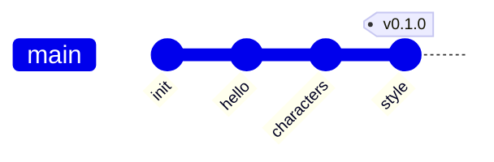

# Version 0.1.0

## Objectifs

Dans cette première version 0.1.0, nous allons implémenter les fonctionnalités suivantes :

- Utilisation de git pour gérer l'historique des modifications du projet
- Utilisation de npm pour gérer les dépendances du projet
- Implémentation d'une page web avec HTML, CSS et JavaScript
    - Contenu statique de la page HTML (**H**yper**T**ext **M**arkup **L**anguage)
    - Application du style avec CSS (**C**ascading **S**tyle **S**heets)
    - Ajout d'interactivité avec **J**ava**S**cript pour afficher les personnages de Marvel



## Prérequis

### Installation de Node.js

Node.js est un environnement d'exécution JavaScript. Il permet d'exécuter du code JavaScript en dehors d'un navigateur web. Il est basé sur le moteur JavaScript V8 de Google, qui est le moteur JavaScript utilisé par le navigateur Chrome.

Pour installer Node.js, rendez-vous sur le site officiel : [https://nodejs.org/en/](https://nodejs.org/en/){:target="_blank"}

Dans un premier temps, nous allons utiliser Node.js pour installer des dépendances, qui sont des bibliothèques JavaScript. La première dépendance que nous allons installer nous permettra de créer un serveur web local.

Nous irons plus loin avec Node.js plus tard, pour utiliser des librairies JavaScript telles que React, qui est une librairie JavaScript développée par Facebook, qui permet de créer des interfaces utilisateur.

### Installation de Visual Studio Code

Visual Studio Code est un éditeur de code open source, développé par Microsoft. Il est disponible pour Windows, Mac et Linux.

Pour installer Visual Studio Code, rendez-vous sur le site officiel : [https://code.visualstudio.com/](https://code.visualstudio.com/){:target="_blank"}

Visual Studio Code est un éditeur de code très complet, qui permet de développer dans de nombreux langages de programmation. Il est très utilisé par les développeurs JavaScript, car il permet d'installer des extensions pour améliorer l'expérience de développement. Nous verrons plus tard comment installer des extensions pour Visual Studio Code.

### Installation de Git

Git est un logiciel de gestion de versions décentralisé. Il permet de gérer l'historique des modifications d'un projet. Il est utilisé par GitHub, qui est un service web d'hébergement et de gestion de code source.

Pour installer Git, rendez-vous sur le site officiel : [https://git-scm.com/](https://git-scm.com/){:target="_blank"}

Nous verrons plus tard comment utiliser Git pour gérer l'historique des modifications de notre projet.

Il est toutefois nécessaire d'appliquer quelques configurations avant de pouvoir utiliser Git, voir [Configurer Git](https://but-sd.github.io/guide-git/configurer-git/){:target="_blank"}.

## Initialisation du projet

### Création du projet sur GitHub

Créer un nouveau projet sur [GitHub](https://github.com){:target="_blank"} avec le nom `marvel-app`. Cocher la case `Initialize this repository with a README`.

Cela va créer un nouveau dépôt de code sur GitHub, avec un fichier README.md. Le fichier README.md est un fichier au format Markdown, qui permet de documenter le projet. Nous verrons plus tard comment utiliser Markdown.

### Clonage du projet

Cloner le projet sur votre ordinateur avec la commande suivante :

```bash
git clone url-du-projet
```

### Initialisation du projet avec npm

Créer un nouveau projet avec la commande suivante :

```bash
npm init -y
```

Cela va créer un nouveau fichier `package.json` à la racine du projet. Ce fichier contient les informations du projet, ainsi que la liste des dépendances du projet.

Modifier le fichier généré pour mettre la version du projet à `0.1.0` :

```json
{
    "version": "0.1.0"
}
```

### Installation des dépendances

Installer la dépendance suivante :

```bash
npm install --save-dev browser-sync
```

Cela va installer la dépendance `browser-sync` dans le dossier `node_modules` du projet. La dépendance sera ajoutée dans la liste des dépendances du projet dans le fichier `package.json`. L'option `--save-dev` permet d'ajouter la dépendance dans la liste des dépendances de développement. Cela permet de distinguer les dépendances de développement des dépendances de production.

`browser-sync` est une dépendance qui permet de créer un serveur web local, avec un rechargement automatique du navigateur à chaque modification du code source. Cela nous permettra de tester simplement la première version de notre application en local.

Les fichiers présents dans le dossier `node_modules` ne doivent pas être versionnés. Nous allons donc les ignorer en créant un fichier `.gitignore` à la racine du projet avec le contenu suivant :

```
node_modules
```

### Configuration de browser-sync

Créer un fichier `bs-config.js` à la racine du projet avec le contenu suivant :

```javascript
module.exports = {
    files: [
        'src/**/*.{html,htm,css,js}'
    ],
    server: {
        baseDir: './src'
    }
};
```

Ce fichier permet de configurer browser-sync. Nous indiquons que nous souhaitons surveiller les fichiers html, css et js dans le dossier `src`, et que le serveur web doit servir les fichiers du dossier `src`.

### Ajout de scripts npm

Modifier le fichier `package.json` pour ajouter les scripts suivants :

```json
{
    "scripts": {
        "start": "browser-sync start --config bs-config.js"
    }
}
```

Cela nous permettra de lancer le serveur web local avec la commande suivante :

```bash
npm start
```

### Création du dossier `src`

Créer un dossier `src` à la racine du projet. Ce dossier contiendra le code source de notre application.

Ajouter un fichier `src/index.html` avec le contenu suivant :

````html
<!DOCTYPE html>
<html lang="en">
    <head>
        <title>Hello, World!</title>
    </head>
    <body>
        <h1>Hello, World!</h1>
    </body>
</html>
````

Lancer le serveur web local avec la commande suivante :

```bash
npm start
```

Ouvrir l'adresse http://localhost:3000 dans un navigateur web. Vous devriez voir le contenu du fichier `index.html`.


Commiter les modifications :

```bash
git add .
git commit -m "Hello, World!"
```

## Ajout de contenu statique

### Ajout de contenu HTML

Modifier le fichier `index.html` pour mettre le contenu suivant :

```html
<!DOCTYPE html>
<html lang="en">
    <head>
        <meta charset="utf-8">
        <title>Marvel App</title>
    </head>
    <body>
        <h1>Marvel App</h1>
        <ul id="characters">
            <li>
                Beast
            </li>
            <li>
                Captain America
            </li>
            <li>
                Deadpool
            </li>
            <li>
                Groot
            </li>
            <li>
                Hulk
            </li>
        </ul>
    </body>
</html>
```

Commiter les modifications :

```bash
git add .
git commit -m "Add static content"
```

### Ajout de contenu CSS

Créer un fichier `src/style.css` avec le contenu suivant :

```css
body {
    font-family: sans-serif;
    margin: 0;
    padding: 0;
}

```

Modifier le fichier `index.html` pour ajouter le lien vers le fichier `style.css` :

```html
<!DOCTYPE html>
<html lang="en">
    <head>
        <meta charset="utf-8">
        <title>Marvel App</title>
        <link rel="stylesheet" href="style.css">
    </head>
    <body>
        <h1>Marvel App</h1>
        <ul id="characters">
            <li>
                Beast
            </li>
            <li>
                Captain America
            </li>
            <li>
                Deadpool
            </li>
            <li>
                Groot
            </li>
            <li>
                Hulk
            </li>
        </ul>
    </body>
</html>
```

L'attribut `rel` permet d'indiquer le type de lien. Ici, nous indiquons que le lien est une feuille de style. L'attribut `href` permet d'indiquer l'adresse du fichier.

L'apparence de la page web devrait changer. Nous avons appliqué un style par défaut au corps de la page web, pour supprimer les marges et les espacements par défaut.

Commiter les modifications :

```bash
git add .
git commit -m "Add style"
```

### Push des modifications

Envoyer les modifications sur GitHub avec la commande suivante :

```bash
git push
```

### Création du tag `v0.1.0`

Créer un tag `v0.1.0` avec la commande suivante :

```bash
git tag v0.1.0 -m "version 0.0.1"
```

Un tag permet de marquer un commit. Cela nous permettra de retrouver facilement les différentes versions de notre projet.

Envoyer le tag `v0.1.0` sur GitHub avec la commande suivante :

```bash
git push origin v0.1.0
```

## Conclusion

Grâce à cette première version 0.1.0, nous avons appris à :

- Préparer notre environnement de développement avec Node.js, Visual Studio Code et Git
- Outiller notre projet pour faciliter le développement (browser-sync)
- Utiliser git pour gérer l'historique des modifications du projet
- Utiliser npm pour gérer les dépendances du projet
- Implémenter une page web avec HTML, CSS
    - Contenu statique de la page HTML (**H**yper**T**ext **M**arkup **L**anguage)
    - Application du style avec CSS (**C**ascading **S**tyle **S**heets)