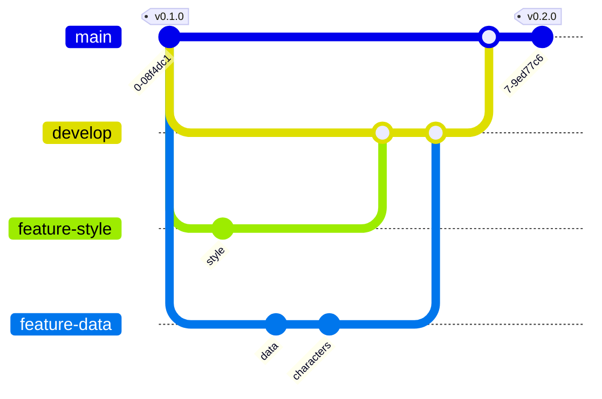

# Version 0.2.0

## Objectifs

La version 0.2.0 va apporter les modifications suivantes :

- Ajout de contenu JavaScript pour récupérer des données depuis un fichier JSON
- Ajout de style CSS pour améliorer l'affichage

Bien que les modifications soient mineures, nous allons voir comment utiliser git pour travailler sur le projet et nous faciliter la vie. Nous allons pouvoir travailler sur les deux fonctionnalités en même temps, et les sauvegarder indépendamment. Nous allons utiliser les branches de git pour cela, en respectant un workflow de développement, appelé [Gitflow](https://but-sd.github.io/memo-git/branches/#git-flow){:target="_blank"}.



## Préparation des branches de travail

### Création de la branche `develop`

Nous allons créer une branche `develop` pour travailler sur les deux fonctionnalités en même temps. Nous allons ensuite créer une branche pour chaque fonctionnalité.

Créer la branche `develop` avec l'une des commandes suivante :

```bash
git checkout -b develop

# ou

git switch -c develop
```

La commande `git checkout` permet de changer de branche. L'option `-b` permet de créer la branche si elle n'existe pas.
La commande `git switch` permet également de changer de branche. L'option `-c` permet de créer la branche si elle n'existe pas.
Les deux commandes sont équivalentes. La commande `git checkout` est dépréciée, et sera supprimée dans une prochaine version de git. Cependant, elle est encore utilisée par beaucoup de développeurs, il n'est pas rare de la voir dans des tutoriels ou des documentations.

Ces deux commandes créeront la branche `develop` à partir de la branche active. La branche active est la branche sur laquelle vous vous trouvez. Pour connaître la branche active, vous pouvez utiliser la commande suivante :

```bash
git branch --show-current
```

### Création des branches `feature/style` et `feature/data`

Nous allons créer deux branches pour les deux fonctionnalités. Nous allons créer les branches `feature/style` et `feature/data` à partir de la branche `develop`.

Créer les branches `feature/style` et `feature/data` avec l'une des commandes suivante :

```bash
git switch -c feature/style develop
git switch -c feature/data develop
```

Le dernier argument de la commande `git checkout` ou `git switch` est la branche à partir de laquelle nous allons créer la nouvelle branche.

## Ajout de style

### Positionnement sur la branche `feature/style`

Se positionner sur la branche `feature/style` avec la commande suivante :

```bash
git switch feature/style
```

### Ajout de contenu CSS

Modifier le fichier `style.css` pour remplacer son contenu par le contenu suivant :

```css
body {
    font-family: sans-serif;
    margin: 0;
    padding: 0;
}

h1 {
    margin: 0;
    padding: 20px;
    background: #333;
    color: #fff;
    text-align: center;
}

ul {
    list-style: none;
    margin: 0;
    padding: 0;
}

li {
    padding: 10px;
    border-bottom: 1px solid #ccc;
}
```

Nous utilisons ici des sélecteurs CSS pour appliquer des styles aux éléments HTML. Nous appliquons un style aux éléments `body`, `h1`, `ul` et `li`. 

Si l'on souhaite cibler plus précisément un élément, nous pouvons utiliser un sélecteur plus spécifique. Par exemple, si l'on souhaite cibler uniquement les éléments `li` qui sont dans la liste des personnages, nous pouvons utiliser le sélecteur `#characters li`. Le `#` permet de cibler un élément par son identifiant. L'identifiant est défini dans le fichier `index.html` avec l'attribut `id`. 

Pour plus de détails sur les sélecteurs CSS, vous pouvez consulter la documentation de [guide-html](https://but-sd.github.io/guide-html/css/#selecteurs){:target="_blank"}.

Commiter les modifications :

```bash
git add .
git commit -m "Add style"
```

## Ajout de contenu dynamique

### Positionnement sur la branche `feature/data`

Se positionner sur la branche `feature/data` avec la commande suivante :

```bash
git switch feature/data
```

### Récupération des données

#### Simulation d'un appel d'API

Dans un premier temps, nous allons simuler un appel d'API pour récupérer des données. Nous verrons plus tard comment appeler une API. Pour cela nous allons charger les données depuis un fichier JSON (**J**ava**S**cript **O**bject **N**otation).

Créer le fichier `src/data/characters.json` avec le contenu suivant :

```javascript

[
    {
        "name": "Beast"
    },
    {
        "name": "Captain America"
    },
    {
        "name": "Deadpool"
    },
    {
        "name": "Groot"
    },
    {
        "name": "Hulk"
    },
    {
        "name": "Iron Man"
    },
    {
        "name": "Rocket Raccoon"
    },
    {
        "name": "Silver Surfer"
    },
    {
        "name": "Thanos"
    },
    {
        "name": "Thor"
    },
    {
        "name": "Wolverine"
    }
]
```

Le fichier `characters.json` contient un tableau d'objets. Chaque objet représente un personnage. Chaque personnage a un attribut `name` qui contient le nom du personnage.

#### Récupération des données

Pour récupérer les données depuis le fichier JSON, nous allons utiliser la fonction `fetch` de JavaScript. Cette fonction permet de faire des requêtes HTTP.

Créer le fichier `src/script.js` avec le contenu suivant :

```javascript
console.log("Welcome to marvel app");

/**
 * Get characters from json file 
 */

const getCharacters = () => {
    const API_URL = 'http://localhost:3000/data/characters.json';
    return fetch(API_URL)
        .then(response => response.json());

};

// Call getCharacters function, and add characters to the list
const characters = getCharacters().then(characters => {
    console.log(characters);
});
```

La fonction `fetch` retourne une promesse. Une promesse est un objet qui représente une valeur qui peut être disponible maintenant, dans le futur, ou jamais. Une promesse peut être dans l'un des états suivants :

- `pending` : la promesse n'est pas encore résolue
- `fulfilled` : la promesse est résolue
- `rejected` : la promesse est rejetée

Pour récupérer la valeur d'une promesse, nous pouvons utiliser la méthode `then`. Cette méthode prend en paramètre une fonction qui sera appelée lorsque la promesse sera résolue. Cette fonction prend en paramètre la valeur de la promesse.

Pour récupérer les personnages, nous devons appeler la fonction `getCharacters`, puis utiliser la méthode `then` pour récupérer les personnages. Nous allons dans un premier temps afficher les personnages dans la console.

Ouvrir la console du navigateur web. Vous devriez voir le tableau des personnages.

Pour plus de détails sur les promesses, vous pouvez consulter la documentation de [guide-html](https://but-sd.github.io/guide-html/js/#async-await){:target="_blank"}.

#### Ajout des personnages à la liste

Modifier le fichier `index.html` pour supprimer les éléments de la liste qui sont en dur et ajouter le script `script.js` pour charger dynamiquement les personnages :

```html
<!DOCTYPE html>

<html lang="fr">

<head>
    <meta charset="utf-8">
    <title>Marvel App</title>
    <link rel="stylesheet" href="style.css">
</head>

<body>
    <h1>Marvel App</h1>
    <ul id="characters"></ul>
    <script src="script.js"></script>
</body>

</html>
```

Commiter les modifications :

```bash
git add .
git commit -m "Add data"
```

### Affichage des personnages

Modifier le fichier `script.js` pour afficher les personnages dans la liste :

```javascript
console.log("Welcome to marvel app");

/**
 * Get characters from json file 
 */

const getCharacters = () => {
    const API_URL = 'http://localhost:3000/data/characters.json';
    return fetch(API_URL)
        .then(response => response.json());

};

// Call getCharacters function, and add characters to the list
const characters = getCharacters().then(characters => {
    const charactersList = document.getElementById('characters');

    characters.forEach(character => {
        const characterElement = document.createElement('li');
        characterElement.textContent = character.name;
        charactersList.appendChild(characterElement);
    });
});
```

Après avoir charger les personnages, on récupère l'élément `ul` avec l'identifiant `characters`. On parcourt ensuite la liste des personnages, et pour chaque personnage on crée un élément `li` que l'on ajoute à l'élément `ul` Pour plus de détail sur la manipulation du DOM en Javascript, vous pouvez consulter la documentation de [guide-html](https://but-sd.github.io/guide-html/js/#selectionner-un-element){:target="_blank" }.

Commiter les modifications :

```bash
git add .
git commit -m "Add characters"
```

Nous avons terminé de travailler sur les deux fonctionnalités. Nous allons fusionner les deux branches vers la branche `develop`.

## Merge vers develop

### Merge de `feature/style`

Nous allons fusionner la branche `feature/style` vers la branche `develop`. La fusion permet de combiner les modifications de deux branches. 

Tout d'abord, nous allons nous positionner sur la branche `develop` avec la commande suivante :

```bash
git switch develop
```

Puis, nous allons utiliser la commande `git merge`. Cette commande prend en paramètre la branche à fusionner. Nous allons fusionner la branche `feature/style` vers la branche `develop` avec la commande suivante :

```bash
git merge feature/style -m "merge feature/style"
```

La commande `git merge` va créer un nouveau commit de fusion. Ce commit de fusion va combiner les modifications de la branche `feature/style` vers la branche `develop`. Nous avons donc à ce moment là la branche `develop` qui contient les modifications de la branche `feature/style`.

### Merge de la branch `feature/data` vers la branche `develop`

Nous allons maintenant fusionner la branche `feature/data` vers la branche `develop`. 

``` bash
git switch develop

git merge feature/data -m "merge feature/data"
```

Il ne devrait pas y avoir de conflit. Si vous avez un conflit, il faut le résoudre avant de continuer.

La branche `develop` contient maintenant les modifications des deux branches `feature/style` et `feature/data`. Nous pouvons maintenant pousser la branche `develop` sur GitHub.

```bash
git push origin develop
```

### Merge de la branche `develop` vers la branche `main`

Les deux fonctionnalités sont terminées. On constate que la branche `develop` contient les modifications des deux fonctionnalités et que celle-ci est pleinnement fonctionnelle. Notre version 0.2.0 est donc terminée. Nous allons maintenant fusionner la branche `develop` vers la branche `main`. La branche `main` est la branche principale du projet. Elle contient les versions stables du projet, c'est à dire les versions qui sont prêtes à être utilisées en production.

```bash
git switch main

git merge develop -m "merge develop"
```

Nous pouvous maintenant pousser la branche `main` sur GitHub.

```bash
git push origin main
```

### Création du tag `v0.2.0`

Afin de marquer la version 0.2.0, nous allons créer un tag. Un tag permet de marquer un commit. Cela nous permettra de retrouver facilement les différentes versions de notre projet.

Créer un tag `v0.2.0` avec la commande suivante :

```bash
git tag v0.2.0 -m "version 0.2.0"
```

Envoyer le tag `v0.2.0` sur GitHub avec la commande suivante :

```bash
git push origin v0.2.0
```

### Suppression des branches `feature/style` et `feature/data`

Les branches `feature/style` et `feature/data` ne sont plus utiles. Nous pouvons les supprimer avec la commande suivante :

```bash
git branch -d feature/style
git branch -d feature/data
```

## Conclusion

Grâce à cette version `0.2.0` nous avons pu :

- Ajouter du contenu dynamique à notre page web
- Ajouter du style à notre page web
- Utiliser le concept de branche pour travailler sur plusieurs fonctionnalités en même temps
- Utiliser le concept de fusion pour combiner les modifications de deux branches
