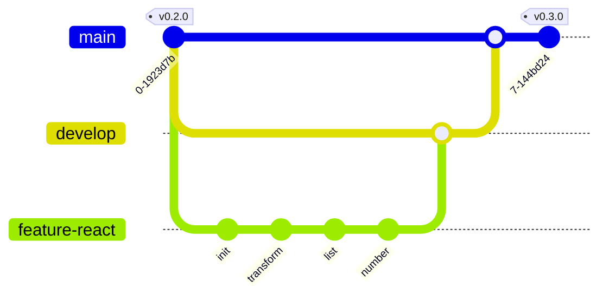
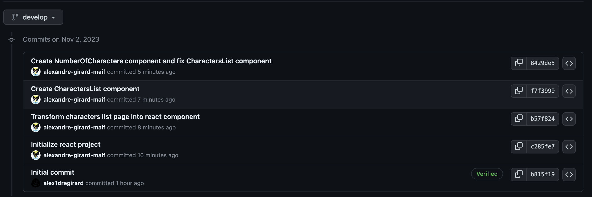

# Version 0.3.0

## Objectifs

Support de présentation : [marvel-app-0.3.0.pdf](./slides/marvel-app-0.3.0.pdf){target=_blank}

La version **0.3.0** va apporter les modifications suivantes :

- Utilisation de la librairie **react** pour créer l'application web



## Initialisation du projet react

### Création d'une nouvelle branche

Basculer sur la branche `develop` et créer la nouvelle branche `feature/react` avec la commande suivante :

```bash
git switch develop
git switch -c feature/react
```

### Initialisation du projet react

Il est possible d'initialiser un projet **react** grâce à l'outil [create-react-ap](https://create-react-app.dev/){target=_blanck} . Nous pourions initialiser le projet **react** avec la commande suivante :

```bash
npx create-react-app .
```

Cependant étant donné que nous avons déjà un projet initialisé, cela risque de poser des problèmes. Nous allons donc initialiser le projet **react** dans un répertoire temporaire, puis copier uniquement les fichiers nécesssaires dans notre projet.

Initialiser le projet **react** avec la commande suivante, dans un répertoire temporaire :

```bash
npx create-react-app react-tmp
```

Vérifier que le projet **react** fonctionne correctement avec la commande suivante :

```bash
cd react-tmp
npm start
```

### Copie des fichiers dans notre projet

Structure d'un projet react

Un projet **react** créé avec **create-react-app** contient un ensemble de fichiers et de dossiers qui permettent de développer une application **react**. 

Voici la liste des fichiers et dossiers d'un projet React créé avec create-react-app :

- node_modules : ce dossier contient les dépendances, il est alimenté par la commande `npm install`. Il n'est pas nécessaire de le copier dans notre projet.
- public : ce dossier contient les fichiers statiques. Nous pouvons copier l'ensemble des fichiers de ce dossier dans notre projet.
- src : ce dossier contient les fichiers sources. C'est dans ce dossier que nous allons développer notre application. Etant donné que nous avons déjà du contenu dans notre dossier `src`, nous allons copier les fichiers dans le répertoire `src` de notre projet et conserver les fichiers existants.
- .gitignore : ce fichier contient la liste des fichiers et dossiers à ignorer par Git. Nous avons déjà un fichier `.gitignore` dans notre projet, nous verrons donc plus tard s'il est nécessaire d'ajouter d'autres fichiers à ignorer.
- package.json : ce fichier contient la liste des dépendances ainsi que les scripts npm. Nous allons copier uniquement les données qui nous intéressent dans notre fichier `package.json`.
    - l'ensemble des scripts npm et renommer le script `start` existant en `start-html-version`  
    - l'ensemble des dépendances `dependencies` qui permettent de faire fonctionner l'application React
    - la partie `eslintConfig` qui permet de configurer eslint (nous verrons plus tard ce qu'est eslint)
    - la partie `browserslist` qui permet de configurer les navigateurs supportés par l'application React

Une fois les fichiers copiés, nous allons installer les nouvelles dépendances avec la commande suivante :

```bash
npm install
```

Et vérifier que l'application **react** fonctionne correctement avec la commande suivante :

```bash
npm run start
```

### Commit et push des modifications

Etant donné que nous avons une application **react** fonctionnelle, nous allons commiter les modifications, pour pouvoir ensuite la modifier.

Commiter les modifications avec la commande suivante :

```bash
git add .
git commit -m "Initialize react project"
```

## Transformation de la page liste des charactères en composant react

### Liste statique des charactères

Dans une application react, le composant racine est appelé `App`. C'est ce composant qui est affiché dans la page web. Nous allons donc transformer la page liste des charactères en composant `App`.

Dans un premier temps, nous allons le créer avec une liste statique de charactères.

Remplacer le contenu du fichier `App.js` par le contenu suivant :

```javascript
import './style.css';

function App() {
  return (
    <>
      <h1>Marvel Characters</h1>
      <ul id="characters">
        <li>
          Beast
        </li>
        <li>
          Captain America
        </li>
        <li>
          Deadpool
        </li>
      </ul>
    </>
  );
}

export default App;
```

Le fichier `App.js`  est un fichier javascript qui exporte une fonction `App`. On constate que cette fonction retourne du code HTML. En effet, react permet de créer des composants en utilisant du code HTML. C'est ce qu'on appelle le JSX (**J**avaScript **S**yntax **E**xtension) 

Quelques explications sur le JSX, [voir](https://but-sd.github.io/guide-react/syntaxe-jsx/){target=_blank}.

Pour la documentation officielle de react sur la partie JSX [voir](https://reactjs.org/docs/introducing-jsx.html){target=_blank}.

### Liste dynamique des charactères

Dans un second temps, nous allons transformer la liste statique de charactères en liste dynamique.

Nous devons modifier le fichier `characters.json` pour ajouter un identifiant à chaque charactère, en effet react a besoin d'un identifiant unique pour chaque élément d'une liste.

```json
[
    {
        "id": "1009175",
        "name": "Beast"
    },
    {
        "id": "1009220",
        "name": "Captain America"
    },
    {
        "id": "1009268",
        "name": "Deadpool"
    },
    {
        "id": "1010743",
        "name": "Groot"
    },
    {
        "id": "1009351",
        "name": "Hulk"
    },
    {
        "id": "1009368",
        "name": "Iron Man"
    },
    {
        "id": "1010744",
        "name": "Rocket Raccoon"
    },
    {
        "id": "1009592",
        "name": "Silver Surfer"
    },
    {
        "id": "1009697",
        "name": "Thanos"
    },
    {
        "id": "1009663",
        "name": "Thor"
    },
    {
        "id": "1009718",
        "name": "Wolverine"
    }
]
```

Nous devons ensuite modifier le fichier `App.js` pour afficher la liste des charactères dynamiquement.

```javascript
import './style.css';

const characters = require('./data/characters.json');

function App() {
  return (
    <>
      <h1>Marvel Characters</h1>
      <ul id="characters">
        {characters.map((character) => (
          <li key={character.id}>{character.name}</li>
        ))}
      </ul>
    </>
  );
}

export default App;
```

Afin de faciliter la compréhension du code, nous avons récupéré la liste des charactères directement depuis le fichier `characters.json`. Nous verrons plus tard comment récupérer des données correctement.

Nous utilisons la fonction `map` pour parcourir la liste des charactères et afficher un élément `li` pour chaque charactère. Nous utilisons l'attribut `key` pour indiquer à react que chaque élément est unique.

### Commit des modifications

Nous avons transformé la page liste des charactères en composant react. Nous allons encore modifier ce composant, mais avant cela, nous allons commiter les modifications.

Commiter les modifications avec la commande suivante :

```bash
git add .
git commit -m "Transform characters list page into react component"
```

## Création de composants react

### Création du composant `CharactersList`

Nous allons ressortir la liste des charactères dans un composant `CharactersList`.

Créer le fichier `src/components/CharactersList.js` avec le contenu suivant :

```javascript
export function CharactersList({ characters }) {
  return (
    <ul id="characters">
      {characters.map((character) => (
        <li key={character.id}>{character.name}</li>
      ))}
    </ul>
  );
}
```

### Utilisation du composant `CharactersList`

Modifier le fichier `App.js` pour utiliser le composant `CharactersList` :

```javascript
import './style.css';
import { CharactersList } from './components/CharactersList';

const characters = require('./data/characters.json');

function App() {
  console.log((characters));

  return (
    <>
      <h1>Marvel Characters</h1>
      <CharactersList characters={characters} />
    </>
  );
}

export default App;
```

### Commit des modifications

Nous avons maintenant un composant `CharactersList` qui permet d'afficher la liste des charactères. Nous pouvons donc commiter les modifications.

Commiter les modifications avec la commande suivante :

```bash
git add .
git commit -m "Create CharactersList component"
```

## Création du composant NumberOfCharacters

### Création du composant `NumberOfCharacters`

Nous allons créer un composant `NumberOfCharacters` qui permet d'afficher le nombre de charactères et de gérer le cas où il n'y a aucun charactère.

Créer le fichier `src/components/NumberOfCharacters.js` avec le contenu suivant :

```javascript
export function NumberOfCharacters({ characters }) {
    if (characters.length === 0) {
      return <p>There is no characters</p>;
    }
  
    return <p>There is {characters.length} characters</p>;
}
```

### Utilisation du composant `NumberOfCharacters`

Modifier le fichier `App.js` pour utiliser le composant `NumberOfCharacters` :

```javascript
import './style.css';
import { CharactersList } from './components/CharactersList';
import { NumberOfCharacters } from './components/NumberOfCharacters';

const characters = require('./data/characters.json');

function App() {

  return (
    <>
      <h1>Marvel Characters</h1>
      <CharactersList characters={characters} />
      <br />
      <NumberOfCharacters characters={characters} />
    </>
  );
}

export default App;
```

Afin de tester le cas où il n'y a aucun charactère, il y a trois possibilités :

- supprimer tous les charactères du fichier `characters.json`
- modifier le fichier `App.js` pour utiliser une liste vide
- ne pas passer de liste de charactères au composant `NumberOfCharacters`

Les deux premières solutions sont équivalentes, car dans les deux cas, le composant `NumberOfCharacters` reçoit une liste vide. Par contre la troisième solution permet de tester le cas où le composant `NumberOfCharacters` est utilisé sans liste de charactères. Et nous allons constater que le composant `NumberOfCharacters` ne gère pas ce cas, ni le composant `CharactersList` d'ailleurs.

Nous verrons plus tard comment tester les composants react, et ainsi valider que l'on gère bien tous les cas.

Si l'on ne passe pas de liste de charactères aux composants `NumberOfCharacters` et `CharactersList`, nous obtenons des erreurs dans la console du navigateur, qui sont aussi visibles dans la page web, car react en mode développement affiche les erreurs dans la page web.

```
Cannot read properties of undefined (reading 'map')

Cannot read properties of undefined (reading 'length')
```

Ces erreurs sont dues au fait que nous essayons d'appeler les fonctions `map` et `length` sur une liste qui n'existe pas. Nous devons donc gérer le cas où la liste de charactères n'existe pas. Pour cela, nous allons modifier les composants `NumberOfCharacters` et `CharactersList` en ajoutant une valeur par défaut pour la liste de charactères.

Modifier le fichier `src/components/CharactersList.js` pour ajouter une valeur par défaut pour la liste de charactères :

```javascript
export function CharactersList({ characters = [] }) {
  return (
    <ul id="characters">
      {characters.map((character) => (
        <li key={character.id}>{character.name}</li>
      ))}
    </ul>
  );
}
```

Modifier le fichier `src/components/NumberOfCharacters.js` pour ajouter une valeur par défaut pour la liste de charactères :

```javascript
export function NumberOfCharacters({ characters = [] }) {
    if (characters.length === 0) {
      return <p>There is no characters</p>;
    }
  
    return <p>There is {characters.length} characters</p>;
}  
```

### Commit des modifications

Nous avons maintenant deux composants `CharactersList` et `NumberOfCharacters` qui permettent d'afficher la liste des charactères, le nombre de charactères et de gérer le cas où il n'y a aucun charactère. Nous pouvons donc commiter les modifications.

Commiter les modifications avec la commande suivante :

```bash
git add .
git commit -m "Create NumberOfCharacters component and fix CharactersList component"
```

Nous avons maintenant une application **react** fonctionnelle. Nous pouvons merge la branche `feature/react` dans la branche `develop`, et pousser les modifications sur GitHub.

Basculer sur la branche `develop` avec la commande suivante :

```bash
git switch develop
```

Merge la branche `feature/react` dans la branche `develop` avec la commande suivante :

```bash
git merge feature/react
```

Pousser les modifications sur GitHub avec la commande suivante :

```bash
git push
```

Supprimer la branche locale `feature/react` avec la commande suivante :

```bash
git branch -d feature/react
```

Cette version de l'application est disponible sur la branche `develop` du dépôt GitHub. 

Bien que l'on ait effectué plusieurs commits, mais un seul push, on constate bien que l'historique de commit est conservé sur GitHub.



Merge de la branche `develop` dans la branche `main` avec la commande suivante :

```bash
git switch main
git merge develop
```

Pousser les modifications sur GitHub avec la commande suivante :

```bash
git push
```

Créer le tag `v0.3.0` avec la commande suivante :

```bash
git tag v0.3.0 -m "version 0.3.0"
```

Pousser le tag `v0.3.0` sur GitHub avec la commande suivante :

```bash
git push origin v0.3.0
```

## Liens utiles

- [React](https://reactjs.org/)
- [create-react-app](https://create-react-app.dev/)
- [React - Les principaux concepts](https://but-sd.github.io/guide-react/)
