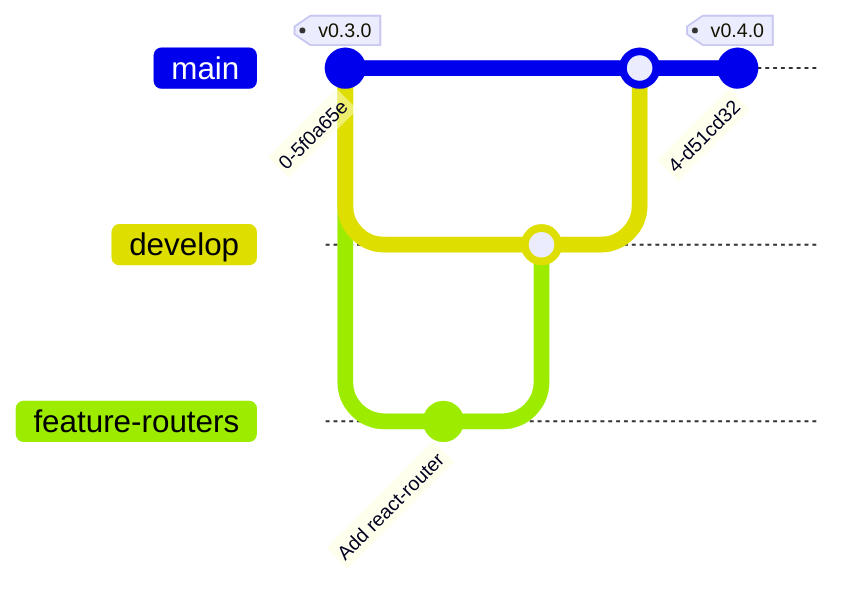

# Version 0.4.0

## Objectifs

- création de plusieurs pages (Home, About, Contact)
- utilisation de react-router pour gérer la navigation entre les pages
- mise en oeuvre d'un layout pour les pages (header, footer, etc...)

Flow git de la version 0.4.0 :



Basculer sur la branche `develop` et créer une nouvelle branche `feature/routers` à partir de la branche `develop`.

```bash
git switch develop
git pull
git switch -c feature/routers
```

## Création de pages

Une page n'est rien d'autre qu'un composant React. Nous allons donc créer un composant pour chaque page.

### AboutPage

Créer un fichier `src/pages/AboutPage.js` avec le contenu suivant :

```javascript
import React from 'react';

const AboutPage = () => {
    // change the title of the page
    document.title = "About | Marvel App";

    return (
        <>
            <h1>About Us</h1>
            <p>We are a team of Marvel fans who love to create awesome apps!</p>
        </>
    );
};

export default AboutPage;
```

La page `AboutPage` est une page statique. Elle affiche simplement un titre et un paragraphe et modifie le titre de la page.

### ContactPage

Créer un fichier `src/pages/ContactPage.js` avec le contenu suivant :

```javascript
import React from 'react';

const ContactPage = () => {
    // change the title of the page
    document.title = "Contact | Marvel App";

    return (
        <>
            <h1>Contact Us</h1>
            <p>
                Feel free to contact us at <a href="mailto:marvelApp@gmail.com">marvelApp@gmail.com</a>
            </p>
        </>
    );
};

export default ContactPage;
```

Comme pour la page `AboutPage`, la page `ContactPage` est une page statique. Elle affiche simplement un titre et un paragraphe et modifie le titre de la page.

### CharactersPage

Créer un fichier `src/pages/CharactersPage.js` avec le contenu suivant :

```javascript
import React from 'react';
import { CharactersList } from "../components/CharactersList";
import { NumberOfCharacters } from "../components/NumberOfCharacters";

const characters = require('../data/characters.json');

const CharactersPage = () => {
    // change the title of the page
    document.title = "Marvel App";

    return (
        <>
            <h1>Marvel Characters</h1>
            <CharactersList characters={characters} />
            <br />
            <NumberOfCharacters characters={characters} />
        </>
    );
};

export default CharactersPage;
```

La page `CharactersPage` utilise les composants `CharactersList` et `NumberOfCharacters` et le fichier `characters.json`. Ceux-ci ne sont pas au même niveau de l'arborescence que la page `CharactersPage`. Il faut donc remonter d'un niveau pour accéder à ces fichiers. 

Le chargement des personnages est pour l'instant statique, nous verrons plus tard comment charger les personnages depuis une API. Les données sont ensuite passées aux composants `CharactersList` et `NumberOfCharacters` via des props.

## Utilisation des pages

Modifier le fichier `App.js` pour ajouter les pages `About`, `Contact` et `CharactersPage` :

```javascript
import './style.css';
import AboutPage from './pages/AboutPage';
import ContactPage from './pages/ContactPage';
import CharactersPage from './pages/CharactersPage';

function App() {

  return (
    <>
      <CharactersPage />
      <AboutPage />
      <ContactPage />
    </>
  );
}

export default App;
```

On remarque que les pages sont affichées les unes à la suite des autres. Il faut donc ajouter un système de navigation pour pouvoir afficher une seule page à la fois.

## Navigation entre les pages

**react-router** est une librairie qui permet de gérer la navigation entre les pages d'une application React.

Quelques explications sur react-router, [voir](https://but-sd.github.io/guide-react/react-router/){target=_blank}

Pour la documentation officielle de react-router, [voir](https://reactrouter.com/){target=_blank}

Installer react-router avec la commande suivante :

```bash
npm install react-router-dom
```

### Layout

Chaque page ayant des éléments en commun (en-tête, pied de page, etc...), nous allons créer un composant `Layout` qui va contenir ces éléments communs.

Créer un fichier `src/Layout.js` avec le contenu suivant :

```javascript
import React from 'react';

const Layout = ({ children }) => {
    return (
        <>
            <header>
                <h1>Marvel App</h1>
                <nav>
                    <a href="/">Home</a>
                    <a href="/about">About</a>
                    <a href="/contact">Contact</a>
                </nav>
            </header>
            <main>
                {children}
            </main>
            <footer>
                <p>Marvel App - 2023</p>
            </footer>
        </>
    );
};

export default Layout;
```

On remarque que le composant `Layout` prend en paramètre un élément `children`. Cet élément sera remplacé par le contenu de la page.

Modifier le fichier `App.js` pour utiliser le composant `Layout` :

```javascript
import './style.css';

import Layout from './Layout';

import AboutPage from './pages/AboutPage';

import ContactPage from './pages/ContactPage';

import CharactersPage from './pages/CharactersPage';

function App() {

  return (
    <Layout>
      <CharactersPage />
      <AboutPage />
      <ContactPage />
    </Layout>
  );
}

export default App;

```

Ce n'est pas encore parfait, car toutes les pages sont affichées en même temps. C'est là qu'intervient react-router.

### Router

Afin de gérer la navigation entre les pages en fonction de l'URL (route), nous allons créer un composant `Router` qui va utiliser **react-router**.
Nous allons définir les routes dans un fichier `routes.js`.

Créer un fichier `src/routes.js` avec le contenu suivant :

```javascript
import Layout from "./Layout";
import AboutPage from "./pages/AboutPage";
import ContactPage from "./pages/ContactPage";
import CharactersPage from "./pages/CharactersPage";

const routes = [
    {
        path: "/",
        element: <Layout />,
        children: [
            { path: "/", element: <CharactersPage /> },
            { path: "/about", element: <AboutPage /> },
            { path: "/contact", element: <ContactPage /> },
        ],
    },
];

export default routes;
```

On remarque que nous avons défini un élément `Layout` comme élément racine de notre application. Cet élément `Layout` va donc être affiché à chaque fois que l'URL correspond à une des routes définies.

Remplacer le contenu du fichier `Layout.js` par le contenu suivant :

```javascript
import React from 'react';
import { Outlet } from "react-router";
import { NavLink } from "react-router-dom";

const Layout = () => {
    return (
        <>
            <header>
                <h1>Marvel App</h1>
                <nav>
                    <NavLink to="/">Home</NavLink> - <NavLink to="/about">About</NavLink> - <NavLink to="/contact">Contact</NavLink>
                </nav>
            </header>
            <main>
                <Outlet />
            </main>
            <footer>
                <p>Marvel App - 2023</p>
            </footer>
        </>
    );
};

export default Layout;
```

Dans cette nouvelle version du composant `Layout`, nous utilisons le composant `Outlet` de react-router à la place de `children`. Ce composant va afficher le contenu de la page en fonction de l'URL. 

Nous utilisons également le composant `NavLink` de react-router pour créer des liens entre les pages, ce composant va ajouter la classe `active` sur le lien correspondant à la page affichée. Nous pourrons donc ajouter un style pour mettre en évidence le lien actif.

De plus les liens créés par le composant `NavLink` ou `Link` vont utiliser le router de react-router, ce qui va permettre de naviguer entre les pages sans recharger la page.

Remplacer le contenu du fichier `App.js` par le contenu suivant :

```javascript
import './style.css';
import { RouterProvider, createBrowserRouter } from 'react-router-dom';

import routes from './routes';

// Create a router that uses the client side history strategy for
const router = createBrowserRouter(routes)

function App() {

  return (
    <RouterProvider router={router} />
  );
}

export default App;
```

Afin d'utiliser react-router, nous devons créer un router qui va utiliser les routes définies dans le fichier `routes.js`. Nous utilisons le composant `RouterProvider` de react-router pour fournir le router à l'application. Nous utilisons également le composant `createBrowserRouter` de react-router pour créer le router.

Nous avons maintenant une application avec plusieurs pages et une navigation entre ces pages. Nous allons devoir modifier le style de l'application pour améliorer l'expérience utilisateur. Par exemple, nous pourrions ajouter un style pour mettre en évidence le lien actif. Ainsi qu'un style pour positionner le footer en bas de la page.

De plus ayant maintenant un header de navigation, l'élément `h1` de chaque page n'est plus du bon niveau de titre. Nous allons donc devoir modifier le niveau de titre de chaque page.

=== "style.css"
    ```css
    body {
        font-family: sans-serif;
        margin: 0;
        padding: 0; 
    }

    h1 {
        margin: 0;
        padding: 20px;
        background: #333;
        color: #fff;
        text-align: center;
    }

    ul {
        list-style: none;
        margin: 0;
        padding: 0;
    }

    li {
        padding: 10px;
        border-bottom: 1px solid #ccc;
    }

    a.active {
        color: red;
    } 

    footer {
        position: absolute;
        bottom: 0;
        width: 100%;
        height: 20px;
        background: #333;
        color: #fff;
        text-align: center;
        padding: 20px;
    }
    ```

=== "pages/CharactersPage.js"
    ```javascript
    import React from 'react';
    import { CharactersList } from "../components/CharactersList";
    import { NumberOfCharacters } from "../components/NumberOfCharacters";

    const characters = require('../data/characters.json');

    const CharactersPage = () => {
        // change the title of the page
        document.title = "Marvel App";

        return (
            <>
                <h2>Marvel Characters</h2>
                <CharactersList characters={characters} />
                <br />
                <NumberOfCharacters characters={characters} />
            </>
        );
    };

    export default CharactersPage;
    ```
=== "pages/AboutPage.js"
    ```javascript
    import React from 'react';

    const AboutPage = () => {
        // change the title of the page
        document.title = "About | Marvel App";

        return (
            <>
                <h2>About Us</h2>
                <p>We are a team of Marvel fans who love to create awesome apps!</p>
            </>
        );
    };

    export default AboutPage;
    ```
=== "pages/ContactPage.js"
    ```javascript
    import React from 'react';

    const ContactPage = () => {
        // change the title of the page
        document.title = "Contact | Marvel App";

        return (
            <>
                <h2>Contact Us</h2>
                <p>
                    Feel free to contact us at <a href="mailto:marvelApp@gmail.com">marvelApp@gmail.com</a>
                </p>
            </>
        );
    };

    export default ContactPage;
    ```

Commiter les modifications :

```bash
git add .

git commit -m "Add react-router"

```

### Merge de la branche `feature/routers` dans la branche `develop`

Merger la branche `feature/routers` dans la branche `develop`, supprimer la branche `feature/routers` et pousser les modifications sur le repository distant. 

```bash
git switch develop

git merge feature/routers

git branch -d feature/routers

git push
```

### Merge de la branche `develop` dans la branche `main`

Merger la branche `develop` dans la branche `main` et pousser les modifications sur le repository distant.

```bash
git switch main

git merge develop

git push
```

## Tag de la version 0.4.0

```bash
git tag v0.4.0 -m "version 0.4.0"
git push origin v0.4.0
```