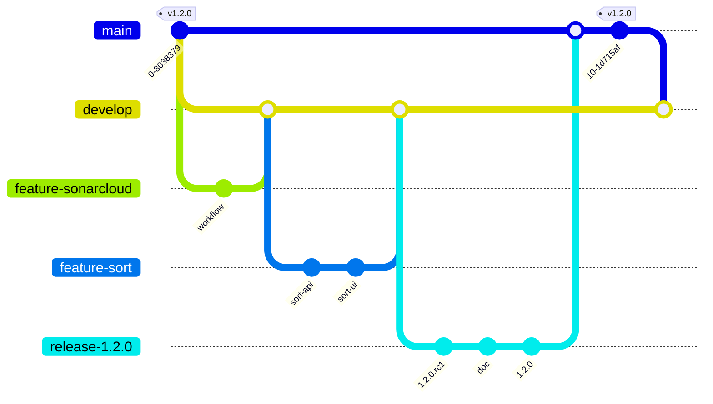

# Version 1.2.0

## Objectifs

La version 1.2.0 va apporter les modifications suivantes :

- Utilisation de la fonctionnalité de `Projects` de GitHub pour gérer les tâches à réaliser
- Qualimétrie du code
- Tri des personnes par nom ou date de modification



## GitHub Projects

GitHub propose une fonctionnalité de gestion de projets. Elle permet de créer des tableaux de tâches à réaliser, en cours de réalisation et réalisées. Ces tableaux sont associés à un dépôt GitHub et sont donc accessibles à tous les collaborateurs du projet.

Github Projects est un équivalent à Jira, mais en plus simple. Jira est un outil beauoup plus robuste en terme de fonctionnalités. Il offre une grande variété de types de tickets, de workflows, de tableaux de bord, etc... Mais il est aussi beaucoup plus complexe à mettre en oeuvre et à utiliser. GitHub Projects est un outil simple et efficace pour gérer les tâches d'un projet. Dans le cadre de ce projet, il est largement suffisant. Et permet de fonctionner en mode agile.

Pour plus de détails sur GitHub Projects, voir [ici](https://but-sd.github.io/guide-github/projects/).

Dans le cadre de ce projet, nous allons utiliser GitHub Projects pour gérer les tâches à réaliser.

## Qualimétrie du code

La qualité du code est un élément important dans le développement d'une application. Elle permet de s'assurer que le code est lisible, maintenable et évolutif. Elle permet aussi de s'assurer que le code est conforme aux bonnes pratiques de développement.

Il existe de nombreux outils pour mesurer la qualité du code. Dans le cadre de ce projet, nous allons utiliser [SonarCloud](https://sonarcloud.io/). SonarCloud est un service cloud qui permet d'analyser la qualité du code d'un projet. Il est gratuit pour les projets open source.

Afin de s'intégrer avec SonarCloud il faut au préalable se créer un compte sur [SonarCloud](https://sonarcloud.io/). 

Puis associer le projet. TODO...

### Intégration avec GitHub

Afin de pouvoir ajouter un **check status**, lors d'un Pull Request, sur la qualité de code, nous allons lancer les analyses sonarcloud depuis une github action.

Créer la branche `feature/sonarcloud` :

```bash
git switch develop
git pull
git switch -c feature/sonarcloud
```

Pour cela, nous allons créer un fichier `.github/workflows/quality.yml` avec le contenu suivant :

```yaml
name: Quality
on:
  push:
  pull_request:
jobs:
  sonarcloud:
    name: SonarCloud
    runs-on: ubuntu-latest
    steps:
      - uses: actions/checkout@v3
        with:
          fetch-depth: 0  # Shallow clones should be disabled for a better relevancy of analysis
      - uses: actions/setup-node@v3
        with:
          node-version: 18
          cache: 'npm'
      - run: npm ci
      - run: npm run test:coverage
      - name: SonarCloud Scan
        uses: SonarSource/sonarcloud-github-action@master
        env:
          GITHUB_TOKEN: ${{ secrets.GITHUB_TOKEN }}  # Needed to get PR information, if any
          SONAR_TOKEN: ${{ secrets.name: Quality
on:
  push:
  pull_request:
jobs:
  sonarcloud:
    name: SonarCloud
    runs-on: ubuntu-latest
    steps:
      - uses: actions/checkout@v3
        with:
          fetch-depth: 0  # Shallow clones should be disabled for a better relevancy of analysis
      - uses: actions/setup-node@v3
        with:
          node-version: 18
          cache: 'npm'
      - run: npm ci
      - run: npm run test:coverage
      - name: SonarCloud Scan
        uses: SonarSource/sonarcloud-github-action@master
        env:
          GITHUB_TOKEN: ${{ secrets.GITHUB_TOKEN }}  # Needed to get PR information, if any
          SONAR_TOKEN: ${{ secrets.SONAR_TOKEN }}
      # Check the Quality Gate status.
      - name: SonarQube Quality Gate check
        id: sonarqube-quality-gate-check
        uses: sonarsource/sonarqube-quality-gate-action@master
        env:
          SONAR_TOKEN: ${{ secrets.SONAR_TOKEN }}
 }}
      # Check the Quality Gate status.
      - name: SonarQube Quality Gate check
        id: sonarqube-quality-gate-check
        uses: sonarsource/sonarqube-quality-gate-action@master
        env:
          SONAR_TOKEN: ${{ secrets.SONAR_TOKEN }}
```

Ce fichier définit une action `Quality` qui va être lancée à chaque `push` ou `pull_request`. Cette action va :

- récupérer le code source
- installer l'envrionnement node
- installer les dépendances
- lancer les tests unitaires aevec la couverture de code
- lancer l'analyse sonarcloud
- vérifier que la qualité du code est bonne grâce à une **Quality Gate**

Cette action utilise 2 secrets :

- `GITHUB_TOKEN` : ce token est automatiquement créé par GitHub et permet d'accéder aux informations du repository
- `SONAR_TOKEN` : ce token est créé sur SonarCloud et permet d'accéder aux informations du projet

TODO : expliquer comment créer le token sonarcloud

### Configuration de SonarCloud

Afin de faire le lien entre projet GitHub et projet SonarCloud, il faut ajouter un fichier `sonar-project.properties` à la racine du projet avec le contenu suivant :

```properties
sonar.projectKey=but-sd_marvel-app-demo
sonar.organization=but-sd

sonar.javascript.lcov.reportPaths=./coverage/lcov.info
sonar.coverage.exclusions=**/*.test.js
```

Ce fichier définit les propriétés du projet SonarCloud :

- `sonar.projectKey` : identifiant du projet SonarCloud
- `sonar.organization` : organisation SonarCloud
- `sonar.javascript.lcov.reportPaths` : chemin vers le fichier de couverture de code
- `sonar.coverage.exclusions` : fichiers à exclure de la couverture de code

Commiter et pusher les modifications :

```bash
git add .github/workflows/quality.yml
git add sonar-project.properties
git commit -m "Add sonarcloud analysis"
git push
```

### Vérification de la qualité du code

A chaque push, une analyse de la qualité du code est lancée. Elle est visible dans l'onglet `Actions` du repository, si le code ne passe pas la **Quality Gate**, l'action est en erreur. Il faut alors corriger les problèmes de qualité du code. On peut aussi voir l'analyse sur SonarCloud.

Nous n'avons pas défini de **Quality Gate** personnalisée, nous utilisons donc la **Quality Gate** par défaut de SonarCloud. Il serait possible de définir une **Quality Gate** personnalisée, mais cela n'est pas nécessaire dans le cadre de ce projet.

La **Quality Gate** par défaut de SonarCloud possède les critères suivants :

- **Coverage** : 80%, il ne faut pas que la couverture de code soit inférieure à 80%
- **Duplicated Lines** : 3%, il ne faut pas que le code dupliqué soit supérieur à 3%, si l'on possède du code dupliqué, il faut le factoriser grâce à des fonctions.
- **Maintainability Rating** : A, il faut que la note de maintenabilité soit supérieure à A, si la note est inférieure à A, il faut améliorer la qualité du code. La note de maintenabilité est calculée à partir de la complexité du code, de la taille du code, etc...
- **Reliability Rating** : A, il faut que la note de fiabilité soit supérieure à A, si la note est inférieure à A, il faut améliorer la qualité du code. La note de fiabilité est calculée à partir de la présence de bugs, de la présence de code mort, etc...
- **Security Rating** : A, il faut que la note de sécurité soit supérieure à A, si la note est inférieure à A, il faut améliorer la qualité du code. La note de sécurité est calculée à partir de la présence de failles de sécurité, etc...
- **Security Hotspots Reviewed** : 0, il ne faut pas de failles de sécurité, si il y en a, il faut les corriger.

