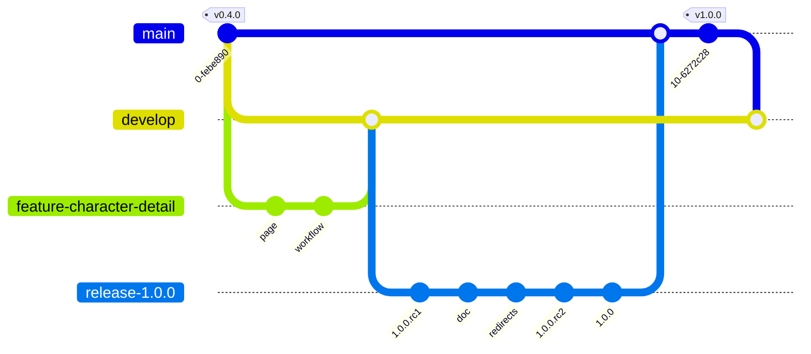

# Version 1.0.0

## Objectifs

- Création de la page de détail d'un charactère
- Sécurisation du projet
    - Création d'un workflow pour vérifier que le code build
    - Protection des branches `main` et `develop`
- Création de pull request pour valider les modifications
- Création d'une release 1.0.0 et déploiement de l'application

Flow git de la version 1.0.0 :



Afin de recetter et déployer "officiellement" la version 1.0.0, nous allons utiliser le service cloud **netlify**.

**Gestion des numéros de version**

Nous passons de 0.4.0 à 1.0.0, modification de numéro de version majeure. L'application en version 1.0.0 est une application fonctionnelle et stable, elle peut être utilisée en production.

Nous utilisons la convention de numérotation [semver](https://semver.org/lang/fr/){target=_blank}. Cette convention permet de définir le numéro de version d'un projet. Le numéro de version est composé de 3 nombres séparés par des points :

- le premier nombre est le numéro de version majeure
- le deuxième nombre est le numéro de version mineure
- le troisième nombre est le numéro de version de patch

Le concept de version majeure, mineure et de patch est utilisé pour définir la compatibilité des versions entre elles dans le cadre de dépendances entre projets. Il est utilisé pour des composants de type librairie ou framework, ou encore pour des projets de type API. 

Dans le cadre d'un projet web, il n'y a pas cette contrainte de dépendances entre projets. Cependant, il est intéressant d'utiliser cette convention pour définir les grandes fonctionnalités de l'application. 

- Le numéro de version majeure permet de mettre en avant la mise à disposition de nouvelles grandes fonctionnalités de l'application. 
- Le numéro de version mineure permet de mettre en avant la mise à disposition de nouvelles fonctionnalités plus petites de l'application.
- Le numéro de version de patch permet de mettre en avant la mise à disposition de corrections de bugs de l'application.

## Création de la page de détail d'un charactère

Créer une branche `feature/character-detail` avec la commande suivante :

```bash
git switch develop
git switch -c feature/character-detail
```

### character-api

Créer un fichier `src/api/character-api.js` avec le contenu suivant :

```javascript
const characters = require('../data/characters.json');

/**
 * Get all characters from json file
 * @returns 
 */
function getCharacters() {
    return characters
}

/**
 * Get character by id
 * @param {number} id 
 * @returns 
 */
function getCharacterById(id) {
    const character = characters.find((character) => character.id === id)
    if (!character) {
        throw new Error(`Character with id ${id} not found`)
    }
    return character
}

module.exports = {
    getCharacters,
    getCharacterById
}
```

L'api `character-api` permet de récupérer les données des personnages. Nous allons utiliser les données du fichier `src/data/characters.json`. Nous créons deux fonctions :

- `getCharacters` : permet de récupérer tous les personnages
- `getCharacterById` : permet de récupérer un personnage par son id

Remarque : Il s'agit d'une version minimaliste d'une api pour illustrer la séparation entre le code de l'application et les données. Nous pourrons ainsi plus tard remplacer les données par des données provenant d'une api externe.

Nous allons modifier le code de l'application pour utiliser cette api, et utiliser la fonctionnalité `loader` de react-router pour charger les données avant d'afficher les pages. Cette fonctionnalité permet de séparer le chargement des données de l'affichage des pages.

**Modification de la définition des routes**

Modifier le fichier `src/routes.js` avec le contenu suivant :

```javascript
import Layout from "./Layout";
import AboutPage from "./pages/AboutPage";
import ContactPage from "./pages/ContactPage";
import CharactersPage from "./pages/CharactersPage";

import CharacterDetailPage from "./pages/CharacterDetailPage";
import { getCharacterById, getCharacters } from "./api/character-api";

const routes = [
    {
        path: "/",
        element: <Layout />,
        children: [
            {
                path: "/",
                element: <CharactersPage />,
                loader: () => getCharacters(),
            },
            {
                path: "/characters/:id",
                element: <CharacterDetailPage />,
                loader: ({ params }) => getCharacterById(params.id),
            },
            { 
                path: "/about", 
                element: <AboutPage /> 
            },
            { 
                path: "/contact", 
                element: <ContactPage /> 
            },
        ],
    },
];

export default routes;

```

Nous avons ajouté la propriété `loader` sur la route `/` pour charger les personnages avant d'afficher la page. 

Nous avons aussi ajouté la route `/characters/:characterId` pour afficher la page de détail d'un personnage. Nous appelons les fonctions `getCharacters` et `getCharacterById` de notre api `character-api`.

**Modification de la page CharactersPage**

Modifier le fichier `src/pages/CharactersPage.js` avec le contenu suivant :

```javascript
import React from 'react';
import { CharactersList } from "../components/CharactersList";
import { NumberOfCharacters } from "../components/NumberOfCharacters";

import { useLoaderData } from 'react-router';

const CharactersPage = () => {
    
    // retrieve the characters using the useLoaderData hook
    const characters = useLoaderData();

    return (
        <>
            <h2>Marvel Characters</h2>
            <CharactersList characters={characters} />
            <br />
            <NumberOfCharacters characters={characters} />
        </>
    );
};

export default CharactersPage;
```

Nous avons modifier le composant `CharactersPage` pour utiliser le hook `useLoaderData` de react-router. Ce hook permet de récupérer les données chargées par la fonction `loader` de la route. Nous avons donc déporté le chargement des personnages dans la route `/` et nous récupérons les personnages dans le composant `CharactersPage` avec le hook `useLoaderData`. 

**Modification du composant CharactersList**

Modifier le fichier `src/components/CharactersList.js` avec le contenu suivant :

```javascript
export function CharactersList({ characters = [] }) {
    return (
        <ul id="characters">
            {characters.map((character) => (
                <li key={character.id}>
                    <a href={`/characters/${character.id}`}>
                        {character.name}
                    </a>
                </li>
            ))}
        </ul>
    );
}
```

Nous avons modifié le composant `CharactersList` pour ajouter un lien vers la page de détail d'un personnage. Nous utilisons la propriété `id` du personnage pour construire l'url de la page de détail du personnage.

**Modification du style**

Modifier le fichier `src/style.css` avec le contenu suivant :

```css

```css
body {
    font-family: sans-serif;
    margin: 0;
    padding: 0;
}

h1 {
    margin: 0;
    padding: 20px;
    background: #333;
    color: #fff;
    text-align: center;
}

ul {
    list-style: none;
    margin: 0;
    padding: 0;
}

li {
    padding: 10px;
    border-bottom: 1px solid #ccc;
}

li a {
    color: #333;
    text-decoration: none;
}

a.active {
    color: red;
}

footer {
    position: absolute;
    bottom: 0;
    width: 100%;
    height: 20px;
    background: #333;
    color: #fff;
    text-align: center;
    padding: 20px;
}
```

Nous avons moidifié les styles pour le éléments de type lien, afin d'avoir un style différent entre les liens du menu et les liens de la liste des personnages

**Modification des données**

Afin d'afficher les détails d'un charactère nous allons ajouter des données dans le fichier `data/characters.json`

```javascript
[
    {
        "id": "1009175",
        "name": "Beast",
        "description": "",
        "modified": "2014-01-13T14:48:32-0500",
        "thumbnail": {
            "path": "http://i.annihil.us/u/prod/marvel/i/mg/2/80/511a79a0451a3",
            "extension": "jpg"
        }
    },
    {
        "id": "1009220",
        "name": "Captain America",
        "description": "Vowing to serve his country any way he could, young Steve Rogers took the super soldier serum to become America's one-man army. Fighting for the red, white and blue for over 60 years, Captain America is the living, breathing symbol of freedom and liberty.",
        "modified": "2020-04-04T19:01:59-0400",
        "thumbnail": {
            "path": "http://i.annihil.us/u/prod/marvel/i/mg/3/50/537ba56d31087",
            "extension": "jpg"
        }
    },
    {
        "id": "1009268",
        "name": "Deadpool",
        "modified": "2020-04-04T19:02:15-0400",
        "thumbnail": {
            "path": "http://i.annihil.us/u/prod/marvel/i/mg/9/90/5261a86cacb99",
            "extension": "jpg"
        }
    },
    {
        "id": "1010743",
        "name": "Groot",
        "description": "",
        "modified": "2013-10-17T15:01:37-0400",
        "thumbnail": {
            "path": "http://i.annihil.us/u/prod/marvel/i/mg/3/10/526033c8b474a",
            "extension": "jpg"
        }
    },
    {
        "id": "1009351",
        "name": "Hulk",
        "description": "Caught in a gamma bomb explosion while trying to save the life of a teenager, Dr. Bruce Banner was transformed into the incredibly powerful creature called the Hulk. An all too often misunderstood hero, the angrier the Hulk gets, the stronger the Hulk gets.",
        "modified": "2020-07-21T10:35:15-0400",
        "thumbnail": {
            "path": "http://i.annihil.us/u/prod/marvel/i/mg/5/a0/538615ca33ab0",
            "extension": "jpg"
        }
    },
    {
        "id": "1009368",
        "name": "Iron Man",
        "description": "Wounded, captured and forced to build a weapon by his enemies, billionaire industrialist Tony Stark instead created an advanced suit of armor to save his life and escape captivity. Now with a new outlook on life, Tony uses his money and intelligence to make the world a safer, better place as Iron Man.",
        "modified": "2016-09-28T12:08:19-0400",
        "thumbnail": {
            "path": "http://i.annihil.us/u/prod/marvel/i/mg/9/c0/527bb7b37ff55",
            "extension": "jpg"
        }
    },
    {
        "id": "1010744",
        "name": "Rocket Raccoon",
        "description": "A genetically-engineered alien with a knack for big guns and fast ships, Rocket serves as the backbone of the Guardians of the Galaxy!",
        "modified": "2014-07-17T17:32:43-0400",
        "thumbnail": {
          "path": "http://i.annihil.us/u/prod/marvel/i/mg/9/b0/50fec1e49298a",
          "extension": "jpg"
        }
    },
    {
        "id": "1009592",
        "name": "Silver Surfer",
        "description": "When Zenn-La was threatened by the world-devouring entity known as Galactus, Norrin Radd stood up for his home planet and offered to work for Galactus, finding him new planets to eat, in exchange for saving his own. Years later, the Surfer has protected Earth and many other planets, becoming one of the greatest heroes in the universe.",
        "modified": "2013-11-07T10:48:53-0500",
        "thumbnail": {
          "path": "http://i.annihil.us/u/prod/marvel/i/mg/3/50/527bb6490a176",
          "extension": "jpg"
        }
    },
    {
        "id": "1009697",
        "name": "Thanos",
        "modified": "2016-05-05T15:35:19-0400",
        "thumbnail": {
            "path": "http://i.annihil.us/u/prod/marvel/i/mg/6/40/5274137e3e2cd",
            "extension": "jpg"
        }
    },
    {
        "id": "1009663",
        "name": "Thor",
        "modified": "2020-03-11T10:18:57-0400",
        "thumbnail": {
            "path": "http://i.annihil.us/u/prod/marvel/i/mg/d/d0/5269657a74350",
            "extension": "jpg"
        }
    },
    {
        "id": "1009718",
        "name": "Wolverine",
        "modified": "2016-05-02T12:21:44-0400",
        "thumbnail": {
            "path": "http://i.annihil.us/u/prod/marvel/i/mg/2/60/537bcaef0f6cf",
            "extension": "jpg"
        }
    }
]
```

### CharacterDetailPage

Créer un fichier `src/pages/CharacterDetailPage.js` avec le contenu suivant :

```javascript
import React, { useEffect } from 'react';

import { useLoaderData } from 'react-router';
import CharacterDetail from '../components/CharacterDetail';

const CharacterDetailPage = () => {
    // retrieve the character using the useLoaderData hook
    const character = useLoaderData();

    useEffect(() => {
        document.title = `${character.name} | Marvel App`;
    }, [character]);
    
    return (
        <>
            <CharacterDetail character={character} />
        </>
    );
};

export default CharacterDetailPage;
```

Nous avons créé la page `CharacterDetailPage` qui affiche le détail d'un personnage. Nous utilisons le hook `useLoaderData` pour récupérer le personnage chargé par la fonction `loader` de la route. Nous utilisons le hook `useEffect` pour mettre à jour le titre de la page web avec le nom du personnage. Nous utilisons le composant `CharacterDetail` pour afficher le détail du personnage.

### CharacterDetail

Créer un fichier `src/components/CharacterDetail.js` avec le contenu suivant :

```javascript
function CharacterDetail({ character = {} }) {
    return (
        <div>
            <h2>{character.name}</h2>
            {
                // if character.thumbnail is not null, then render the image
                character.thumbnail && 
            }
            <p>{character.description}</p>
            <p>{character.modified}</p>
        </div>
    );
}

export default CharacterDetail;
```
Nous affichons le nom, la description, la date de modification et l'image du personnage. L'api peut ne pas renvoyer l'image du personnage, nous vérifions donc que la propriété `thumbnail` n'est pas nulle avant d'afficher l'image afin d'éviter une erreur.

Commiter et pusher les modifications :

```bash
git add .
git commit -m "Add character detail page"
git push --set-upstream origin feature/character-detail
```

## Sécurisation du projet

Afin de sécuriser le projet, nous allons mettre en place des contrôles avant de valider les modifications appportées au code source des branches `main` et `develop`:

- contrôle que le code build correctement et que la qualité du code est suffisante (version basique que nous améliorerons plus tard)
- contrôle que les modifications sont validées par un autre développeur avant d'être intégrées au projet

#### Créaction d'un wokflow pour vérifier que le code build

github permet d'automatiser certaines tâches grâce aux `workflows` et de réagir à certains événements comme un `push` ou une `pull request`. Les executions du workflow sont visibles dans l'onglet `Actions` du repository.

Quelques explications sur les actions, [voir](https://but-sd.github.io/guide-github/actions/){target=_blank}.

Créer un fichier `.github/workflows/build.yml` avec le contenu suivant :

```yaml
name: Build

on:
  push:
  pull_request:

jobs:
  build:

    runs-on: ubuntu-latest

    steps:
    - uses: actions/checkout@v3
    - uses: actions/setup-node@v3
      with:
        node-version: 18
        cache: 'npm'
    - run: npm ci
    - run: npm run build
```

Ce workflow permet de vérifier que le code build. Il est déclenché à chaque push et à chaque pull request quelque soit la branche. Il est composé d'un seul job `build` qui s'exécute sur une machine virtuelle `ubuntu-latest`. Le job est composé de 4 étapes :

- `checkout` : permet de récupérer le code source du projet
- `setup-node` : permet d'installer la version 18 de node.js et de restaurer le cache npm
- `npm ci` : permet d'installer les dépendances du projet 
- `npm run build` : permet de lancer le build du projet

Pour un projet créé avec `react-create-app`, le build génère le livrable mais permet aussi de vérifier que le code est valide et qu'il n'y a pas d'erreur de syntaxe. En cas d'erreur, le build échoue. Les warnings affichés dans la console lorsque l'on lance `npm run start` qui ne sont pas bloquant durant le développement deviennent bloquant lors du build en production. Cela permet de s'assurer que le code est valide.

Une fois le workflow créé, nous pouvons le tester en modifiant le code source et en poussant les modifications sur GitHub. Le résultat du workflow est visible sur la page des actions du projet sur GitHub.

Si le workflow échoue, il est possible de voir les logs d'exécution du workflow en cliquant sur le nom du workflow dans la page des actions du projet sur GitHub. Cela permet de voir les erreurs et de les corriger ensuite en local avant de pousser les modifications sur GitHub.

Commiter et pusher les modifications :

```bash
git add .
git commit -m "Add build workflow"
git push
```

### Protection des branches `main` et `develop`

Nous allons protéger les branches `main` et `develop` :

- afin d'éviter de les modifier directement et de forcer l'utilisation des pull requests
- afin de mettre en oeuvre la revue de code
- afin de vérifier que le code poussé sur ces branches build correctement

Pour les explications sur la protection des branches, [voir](https://but-sd.github.io/guide-github/pull-request/#protection-des-branches){target=_blank}.
Et pour l'ajout des `status checks`, [voir](https://but-sd.github.io/guide-github/pull-request/#require-status-checks-to-pass-before-merging){target=_blank}.

## Pull request

La Pull Request est une fonctionnalité de GitHub qui permet de proposer la validation de modifications du code source d'un projet. 

La pull request va permettre de discuter des modifications proposées avant de les intégrer au projet, de mettre en oeuvre la revue de code, pratique qui consiste à faire relire son code par un autre développeur. Cela permet de s'assurer de la qualité du code et de partager les connaissances entre les développeurs. La revue de code est une pratique très répandue dans les entreprises.

Quelques expliquations sur les pull requests, [voir](https://but-sd.github.io/guide-github/pull-request/){target=_blank}.

### Création de la pull request

Maintenant que nous avons terminé la feature `character-detail` et protégé les branches `main` et `develop`, nous allons proposer la validation de la feature au travers d'une pull request. Nous allons utiliser la fonctionnalité `compare` de GitHub pour comparer la branche `feature/character-detail` avec la branche `develop` et utiliser la fonctionnalité `create pull request` de GitHub pour créer la pull request.


Grâce à la fonctionnalité `compare` de GitHub, nous pouvons voir les différences entre les deux branches. Nous pouvons voir qu'il y a eu 2 commits sur la branche `feature/character-detail` et que 9 fichiers ont été modifiés. Nous pouvons voir les différences entre les deux branches pour chaque fichier.

Nous pouvons créer la pull request en cliquant sur le bouton `create pull request`.


Lors de la création de la pull request, nous allons utiliser la fonctionnalité `reviewers` de GitHub pour demander à un autre développeur de relire notre code. Nous allons utiliser la fonctionnalité `assignees` de GitHub pour s'assigner la pull request. Nous allons utiliser la fonctionnalité `labels` de GitHub pour ajouter le label `enhancement` à la pull request.

Remarque : Pour pouvoir avoir accès à la fonctionnalité `reviewers`, il faut que le développeur soit membre du projet. Pour cela, il faut que le développeur fasse une demande d'accès au projet. Le propriétaire du projet doit accepter la demande d'accès pour que le développeur devienne membre du projet. Ou bien, le propriétaire du projet peut ajouter le développeur comme membre du projet (Settings >  Access > Collaborators).

Les pull requests sont visibles dans l'onglet `Pull requests` du repository. Nous pouvons voir la pull request que nous venons de créer.

### Validation de la pull request


Une fois l'ensemble des status checks passés, nous pouvons valider la pull request, en utilisant la fonctionnalité `merge pull request`. Nous pouvons voir que la pull request est validée et que le code est mergé sur la branche `develop`.


## Release

### Préparation

Le workflow de développement gitflow prévoit la création d'une branche `release` à partir de la branche `develop` pour préparer la mise en production d'une nouvelle version de l'application. Cette branche va permettre de tester l'application avant de la mettre en production, voir [guide-git](https://but-sd.github.io/guide-git/branches/#git-flow){target=_blank} pour plus d'explications.

Nous allons créer une branche `release/1.0.0` à partir de la branche `develop` avec la commande suivante :

```bash
git switch develop
git switch -c release/1.0.0
```

#### Mise à jour de la version

Nous allons modifier le fichier `package.json` pour mettre à jour la version du projet, nous allons passer de la version `0.4.0` à la version `1.0.0.rc1`.

```json
{
  "name": "marvel-app",
  "version": "1.0.0.rc1",
  ...
}
```

Le `rc` signifie `release candidate`. Cela signifie que nous allons tester cette version avant de la mettre en production. Si cette version est validée, nous allons la mettre en production. Si cette version n'est pas validée, nous allons la corriger et créer une nouvelle version `1.0.0.rc2` par exemple.

Une fois une version `rc*` validée, nous mettrons en production et supprimerons le `rc` pour avoir la version `1.0.0`.

Commiter les modifications :

```bash
git add package.json
git commit -m "Update version to rc1"
git push --set-upstream origin release/1.0.0
```

#### Mise à jour de la documentation

La phase de release est l'occasion de mettre à jour la documentation. Nous allons ici mettre à jour le fichier `README.md` pour indiquer comment installer et lancer l'application. Nous utilisons le format Markdown pour écrire le fichier `README.md`. Nous verrons plus tard comment utiliser Markdown.

```markdown

# Marvel App

## Installation

git clone url-du-projet
cd marvel-app

npm install

## Lancement

npm start

L'application est accessible à l'adresse http://localhost:3000
```

Commiter et pusher les modifications :

```bash
git add README.md
git commit -m "Update documentation"
git push
```

La release est maintenant prête à être déployée. C'est le moment de tester l'application et de vérifier que tout fonctionne correctement grâce à une recette utilisateur. La recette utilisateur est une phase de test manuel de l'application par les utilisateurs. C'est durant cette phase que nous allons détecter les éventuels bugs et les corriger. C'est aussi durant cette phase que nous allons détecter les éventuels problèmes d'ergonomie et les corriger mais aussi détecter les éventuels problèmes de performance et les corriger.

Si des bugs sont détectés, ils seront corrigés sur la branche `release/1.0.0`. Le numéro de `rc` sera incrémenté pour indiquer qu'une nouvelle version release candidate est disponible.

#### Déploiement sur netlify

Nous allons déployer l'application sur **netlify**. netlify est un service cloud qui permet de déployer des applications web.

Créer un compte sur [netlify](https://app.netlify.com/signup){target=_blank} avec le compte GitHub.

Dans la partie `Site Configuration/Build & Deploy/Continuous Deployment`, dans la section `Branches and deploy contexts` cliquer sur `configure`. La Production branch doit être `main` et `Any pull request again your production branch` doit être cochée.

Cela va nous permettre d'avoir un déploiement automatique de l'application à chaque push sur la branche `main` et à chaque pull request sur la branche `main`. Nous pourrons ainsi avoir en parallèle la branche de production et les branches de "recette".

#### Création de la pull request release/1.0.0

Créer une pull request `release/1.0.0` à partir de la branche `release/1.0.0` vers la branche `main`.

Grâce à la configuration ci-dessus, la création de la pull request `release/1.0.0` va déclencher un déploiement de l'application sur netlify. Nous pourrons ainsi tester l'application avant de la mettre en production.

netlify va mettre à jour la pull request avec le lien vers l'application déployée.

Afin d'avoir une application fonctionnelle, nous devons ajouter un fichier `_redirects` à la racine du projet avec le contenu suivant:

```
/*    /index.html   200
```

Ce fichier permet de rediriger toutes les requêtes vers la page `index.html` de l'application. Cela permet de gérer les routes de l'application.

Commiter et pusher les modifications :

```bash
git add _redirects
git commit -m "Add _redirects file"
git push
```

### Mise à jour des branches main et develop

Une fois la recette utilisateur terminée et les bugs corrigés, la branche `release/1.0.0` est validée et nous pouvons la mettre en production en figeant la version à `1.0.0`.

```json
{
  "name": "marvel-app",
  "version": "1.0.0",
  ...
}
```

Commiter et pusher les modifications :

```bash
git add package.json
git commit -m "Update version to 1.0.0"
git push
```

Nous pouvons valider la pull request `release/1.0.0`. Nous pouvons aussi supprimer la branche `release/1.0.0` car elle n'est plus utile.

Une fois la branche `main` à jour avec les fonctionnalités de la branche `release/1.0.0`, nous allons mettre à jour la branche `develop` pour récupérer les fonctionnalités de la branche `release/1.0.0`.

Pour cela nous allons créer et valider une pull request de `main` vers `develop`.

### Création de la release

Nous allons utiliser la fonctionnalité `create release` de GitHub pour créer la release. La release ce base sur un tag git et ajoute des fonctionnalités supplémentaires. La release est visible dans l'onglet `Releases` du repository.

Elle permet d'ajouter des notes de version, des captures d'écran, etc... Elle permet aussi de télécharger le code source de la release.

