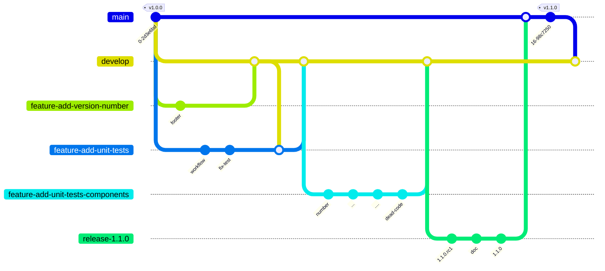
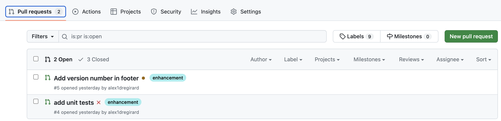
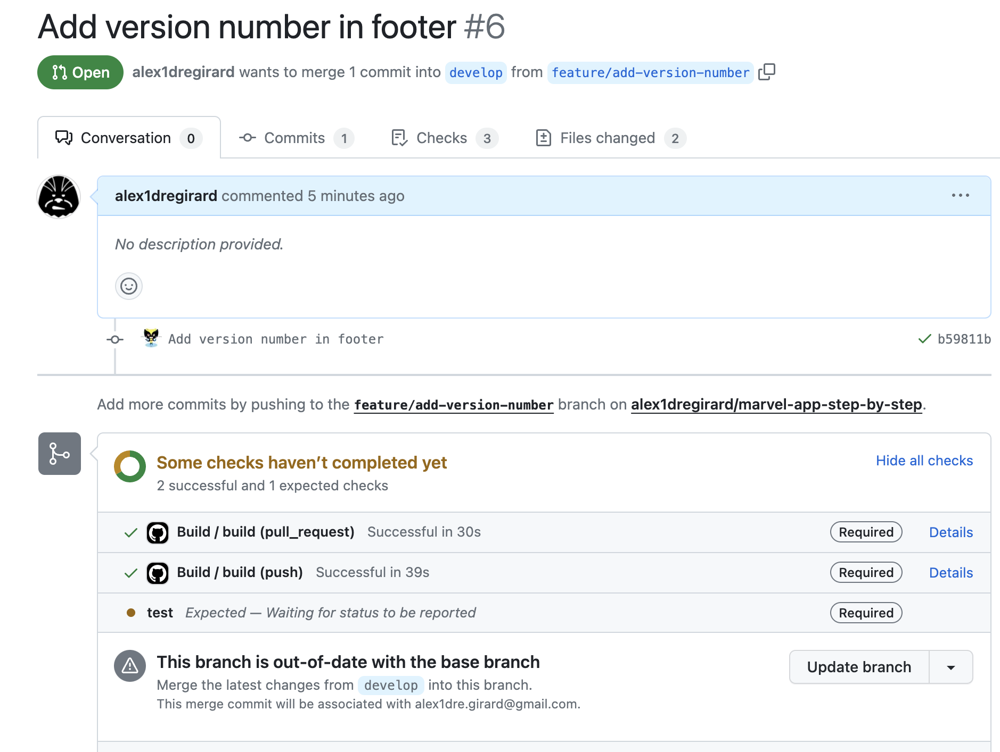
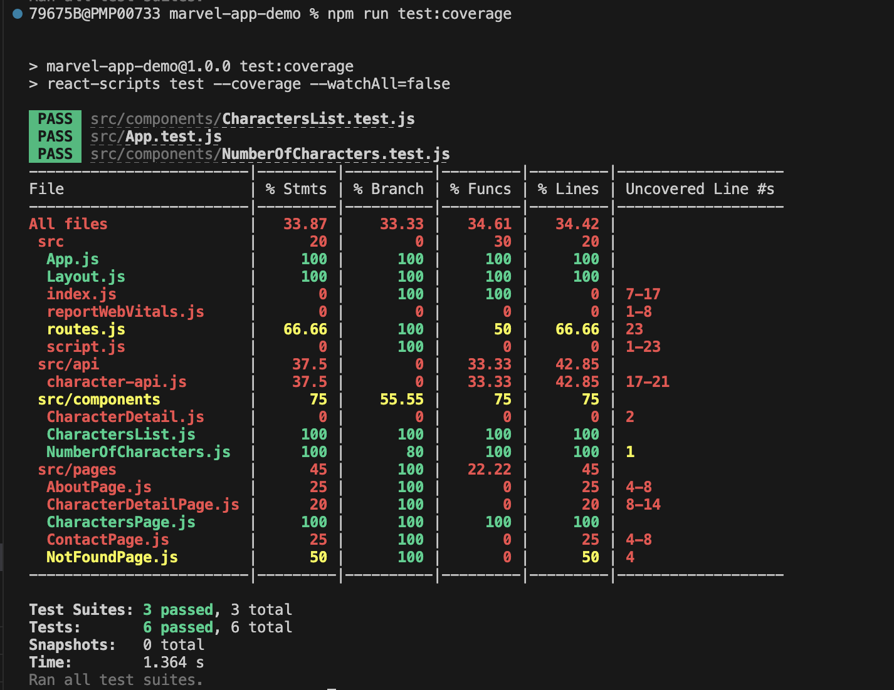

# Version 1.1.0

## Objectifs
La version 1.1.0 va apporter les modifications suivantes :

- Ajout du numéro de version dans le footer
- Mise en oeuvre des tests unitaires
- Mise en oeuvre du workflow de test unitaire
- Ajout de tests unitaires pour 
    - `src/components`
    - `src/api`
    - `src/pages`
- Exclure certains fichiers du rapport de couverture de code
- Suppression du code mort

## Mise en oeuvre de 2 développements en parallèle

Nous allons mettre en oeuvre 2 développements en parallèle pour voir comment gérer les mises à jour de code source.



## Ajout du numéro de version dans footer

Nous allons ajouter le numéro de version dans le footer de l'application. Cela permettra de vérifier que la bonne version de l'application est déployée.

Créer la branche `feature/add-version-number` :

```bash
git switch develop
git switch -c feature/add-version-number
```

Modifier le fichier `src/Layout.js` avec le contenu suivant :

```javascript
import React from 'react';
import { Outlet } from "react-router";
import { NavLink } from "react-router-dom";
import packageJson from '../package.json';

const Layout = () => {
    const version = packageJson.version;

    return (
        <>
            <header>
                <h1>Marvel App</h1>
                <nav>
                    <NavLink to="/">Home</NavLink> - <NavLink to="/about">About</NavLink> - <NavLink to="/contact">Contact</NavLink>
                </nav>
            </header>
            <main>
                <Outlet />
            </main>
            <footer>
                <p>Marvel App - {version}</p>
            </footer>
        </>
    );
};

export default Layout;
```

Nous utilisons ici la variable `version` du fichier `package.json` pour afficher le numéro de version de l'application.

Modifier le fichier `package.json` pour ajouter la version de l'application :

```json
{
  "name": "marvel-app",
  "version": "1.1.0",
  ... 
}
```

Commiter les modifications et pusher les modifications sur GitHub :

```bash
git add src/Layout.js
git add package.json

git commit -m "Add version number in footer"
git push --set-upstream origin feature/add-version-number
```

Créer une pull request, sans la valider, sur GitHub pour merger plus tard, la branche `feature/add-version-number` dans la branche `develop`. 

## Mise en oeuvre des tests unitaires

Lors de la création du projet avec `create-react-app`, un fichier `src/App.test.js` a été créé. Ce fichier contient un exemple de test unitaire avec la librairie `jest`. Nous allons utiliser cette librairie pour écrire nos tests unitaires.

Pour lancer les tests unitaires, exécuter la commande suivante :

```bash
npm test
```

Cela va lancer jest en mode watch. A chaque modification d'un fichier, jest va relancer les tests unitaires. La consolse s'affiche et permet de lancer les tests unitaires, de les relancer, de les filtrer, etc...

Par exemple pour lancer toutes les suites de tests, il suffit de taper `a` dans la console.

On constate que le test unitaire de `App.js` est en erreur. C'est normal, car le composant `App` a évolué depuis la création du projet. Nous allons donc modifier le test unitaire pour qu'il soit à nouveau valide.

Avant de modifier le code source, nous allons créer la branche `feature/add-unit-tests` pour travailler sur cette fonctionnalité.

```bash
git switch develop
git switch -c feature/add-unit-tests
```

**Mise en oeuvre du workflow de test unitaire**

Nous allons maintenant mettre en oeuvre un workflow de test unitaire. L'objectif est de lancer les tests unitaires à chaque push, ce qui permettra de vérifier que le code source est toujours valide. Et permettra de rajouter un `status check` sur github et donc de bloquer les pull requests si les tests unitaires ne sont pas valides.

Créer un fichier `.github/workflows/unit-tests.yml` avec le contenu suivant :

```yaml
name: Unit Tests

on:
  push:
  pull_request:

jobs:
    test:
        runs-on: ubuntu-latest
        steps:
            - uses: actions/checkout@v3
            - uses: actions/setup-node@v3
              with:
                node-version: 18
                cache: 'npm'
            - run: npm ci
            - run: npm run test

```

Commiter et pusher les modifications :

```bash
git add .github/workflows/unit-tests.yml
git commit -m "Add unit tests workflow"
git push origin feature/add-unit-tests
```

Modifier la protection des branches `develop` et `main` pour ajouter le `status check` sur le workflow de test unitaire (nommé __test__), afin de bloquer les pull requests si les tests unitaires ne sont pas valides. Vérifier que la case `Require branches to be up to date before merging` est cochée, cela permet de vérifier que la branche de la pull request est bien à jour avec la branche de destination.

Créer une pull request pour merger la branche `feature/add-unit-tests` dans la branche `develop`. Le workflow de test unitaire est lancé et la pull request est bloquée, car le test unitaire de `App.js` est en erreur.

## Pull requests

Nous avons 2 pull requests en attente de validation :

- `feature/add-version-number` : Add version number in footer
- `feature/add-unit-tests` : add unit tests

La pull request `feature/add-version-number` est bloquée (en orange), car nous avons ajouté un `status check` sur le workflow de test unitaire, mais cette branche ne contient pas le fichier `.github/workflows/unit-tests.yml`. 

La pull request `feature/add-unit-tests` est bloqué (en rouge), car le test unitaire de `App.js` est en erreur.



Nous allons fixer le test unitaire de `App.js` pour que la pull request `feature/add-unit-tests` soit valide et que nous puissions la merger dans la branche `develop`.

**Correction du test unitaire de `App.js`**

Modifier le fichier `src/App.test.js` avec le contenu suivant :

```javascript
import { render, screen } from '@testing-library/react';
import App from './App';

test('renders learn react link', () => {
  render(<App />);

  const h1Element = screen.getByRole('heading', { level: 1, name: "Marvel App" });
  expect(h1Element).toBeInTheDocument();
});
```

Le test unitaire vérifie que le composant `App` contient un titre `h1` avec le texte `Marvel App`. Le test unitaire est à nouveau valide. Nous ferons évoluer ce test unitaire par la suite pour le rendre plus pertinent. Cependant ce test unitaire est déjà utile, car il permet de vérifier que le composant `App` est bien rendu, ce qui veut dire que l'application est bien lancée.

Commiter les modifications et pusher les modifications sur GitHub :

```bash
git add src/App.test.js
git commit -m "Fix unit test for App.js"
git push --set-upstream origin feature/add-unit-tests
```

La pull request `feature/add-unit-tests` est à nouveau valide, on peut donc merger la pull request. 

**Mise à jour de la pull request `feature/add-version-number`**

On constate que la pull request `feature/add-version-number` est toujours bloquée, car elle ne contient toujours pas le fichier `.github/workflows/unit-tests.yml`, mais nous avons aussi un nouveau message car la branche `feature/add-unit-tests` n'est pas à jour avec la branche `develop`. 



Nous allons donc mettre à jour la branche `feature/add-version-number` avec la branche `develop`, en cliquant sur le bouton `Update branch`. Il ne devrait pas y avoir de conflit, car nous n'avons pas modifié le même fichier dans les 2 branches. La pull request `feature/add-version-number` est à nouveau valide, on peut donc merger la pull request.

La branche `develop` est maintenant à jour avec les 2 pull requests validées. Nous avons donc une branche `develop` qui contient les 2 fonctionnalités:

- Ajout du numéro de version dans le footer
- Mise en oeuvre des tests unitaires

Nous allons maintenant ajouter des tests unitaires pour les composants de l'application.

## Ajout de tests unitaires pour `src/components`

Nous allons créer une branche `feature/add-unit-tests-components` pour travailler sur les tests unitaires des composants.

```bash
git switch develop
git pull
git switch -c feature/add-unit-tests-components
```

### NumberOfCharacters

Lorsque l'on met en oeuvre des test unitaires, on souhaite tester tout les cas possibles. Pour cela, on va utiliser le principe de la `partition de l'espace d'entrée`. Cela consiste à définir les différentes valeurs possibles pour chaque paramètre d'une fonction. Pour chaque combinaison de valeurs, on va tester le comportement de la fonction.

Dans le cas de `NumberOfCharacters`, nous avons un seul paramètre, qui est `characters`. Nous allons donc tester les cas suivants :

- `characters` est `null`, c'est à dire que la fonction est appelée sans paramètre
- `characters` est vide
- `characters` contient des éléments

Nous avons donc 3 cas à tester. Nous allons donc devoir créer 3 tests unitaires. 

Cependant en regardant le composant, on constate que l'on pourrait avoir un 4ème cas, lorsque `characters` contient un seul élément, dans ce cas, il faudrait afficher `There is 1 character` sans `s`. Nous allons donc créer un 4ème test unitaire.

Créer un fichier `src/components/NumberOfCharacters.test.js` avec le contenu suivant :

```javascript
import { render } from '@testing-library/react';
import { NumberOfCharacters } from './NumberOfCharacters';

describe('NumberOfCharacters', () => {

  it('renders "There is no characters" when characters prop is empty', () => {
    const { getByText } = render(<NumberOfCharacters characters={[]} />);
    expect(getByText('There is no characters')).toBeInTheDocument();
  });

  it('renders "There is no characters" when characters prop is not passed', () => {
    const { getByText } = render(<NumberOfCharacters />);
    expect(getByText('There is no characters')).toBeInTheDocument();
  });

  it('renders "There is 1 character" when characters prop has 1 item', () => {
    const { getByText } = render(<NumberOfCharacters characters={['Iron Man']} />);
    expect(getByText('There is 1 character')).toBeInTheDocument();
  });

  it('renders "There is 2 characters" when characters prop has 2 items', () => {
    const { getByText } = render(<NumberOfCharacters characters={['Iron Man', 'Spider-Man']} />);
    expect(getByText('There is 2 characters')).toBeInTheDocument();
  });
  
});
```

Nous avons donc 4 tests unitaires qui vérifient que le composant `NumberOfCharacters` affiche le bon texte en fonction du nombre de personnages. Nous avons donc testé les 4 cas possibles et constatons qu'un des tests unitaires est en erreur. C'est normal, car nous n'avons pas encore implémenté le code pour gérer le cas où `characters` contient un seul élément.

En écrivant d'abord le test unitaire, nous nous assurons que le test unitaire est en erreur avant d'écrire le code. Cela permet de vérifier que le test unitaire est bien valide. Cette pratique s'appelle le `test driven development` (TDD). Notre composant sera donc valide lorsque le test unitaire sera valide.

Modifier le fichier `src/components/NumberOfCharacters.js` avec le contenu suivant :

```javascript
export function NumberOfCharacters({ characters = [] }) {
  if (characters.length === 0) {
    return <p>There is no characters</p>;
  } else if (characters.length === 1) {
    return <p>There is 1 character</p>;
  } else {
    return <p>There is {characters.length} characters</p>;
  }
}
```

Le test unitaire est à nouveau valide et nous avons testé tous les cas possibles, la couverture de code est donc de 100%. Nous allons voir juste après, comment mesurer cette couverture de code.

Maintenant que nous avons écrit le code et le test unitaire, on peut refactorer le code pour le simplifier sans risque, en effet, si le test unitaire est toujours valide, c'est que le comportement de la fonction n'a pas changé.

Une version simplifiée du composant `NumberOfCharacters` est la suivante :

```javascript
export function NumberOfCharacters({ characters = [] }) {
  return (
    <p>
      There is {characters.length === 0 ? 'no' : characters.length} character{characters.length !== 1 ? 's' : ''}
    </p>
  );
}
```

Nous utilisons ici l'opérateur ternaire pour simplifier le code. Le code est plus court et plus lisible.

Commiter les modifications :

```bash
git add src/components/NumberOfCharacters.js
git add src/components/NumberOfCharacters.test.js
git commit -m "Add unit tests for NumberOfCharacters"
```

### CharactersList

Nous allons maintenant ajouter des tests unitaires pour le composant `CharactersList`. Nous allons utiliser le même principe que pour `NumberOfCharacters`, c'est à dire tester tous les cas possibles.

La fonction `CharactersList` prend elle aussi un seul paramètre, qui est `characters`. Nous allons donc tester les cas suivants :

- `characters` est `null`
- `characters` est vide
- `characters` contient des éléments

Pour chaque élément de `characters`, nous utilisons ensuite les propriétés `id`, `name`, nous n'allons pas tester les cas où ces propriétés sont `null` ou `undefined`, car ces cas ne sont pas possible dans notre application.

Créer un fichier `src/components/CharactersList.test.js` avec le contenu suivant :

```javascript
import { render, screen } from '@testing-library/react';
import { CharactersList } from './CharactersList';
import { BrowserRouter } from 'react-router-dom'


describe('CharactersList', () => {

    it('renders a list of characters', () => {
        // when
        const characters = [
            { id: 1, name: 'Iron Man' },
            { id: 2, name: 'Captain America' },
            { id: 3, name: 'Thor' },
        ];

        // then
        render(<CharactersList characters={characters} />, { wrapper: BrowserRouter });

        // expect a list with the id "characters" to be in the document
        const characterList = screen.getByRole('list', { id: 'characters' });
        expect(characterList).toBeInTheDocument();

        // expect a listitem for each character
        const characterItems = screen.getAllByRole('listitem');
        expect(characterItems).toHaveLength(characters.length);

        // expect each listitem to have the character name and a link to the character detail page
        characterItems.forEach((item, index) => {
            // expect each listitem to have the character name
            expect(item).toHaveTextContent(characters[index].name);

            // expect each listitem to have a link to the character detail page
            const link = screen.getByRole('link', { name: characters[index].name });
            expect(link).toBeInTheDocument();
            expect(link).toHaveAttribute('href', `/characters/${characters[index].id}`);
        });

    });

    it('renders an empty list when no characters are provided', () => {
        // when

        // then
        render(<CharactersList />, { wrapper: BrowserRouter });

        // expect a list with the id "characters" to be in the document
        const characterList = screen.getByRole('list', { id: 'characters' });
        expect(characterList).toBeInTheDocument();

        // expect no listitems
        const characterItems = screen.queryAllByRole('listitem');
        expect(characterItems).toHaveLength(0);
    });

});

```

Une bonne pratique de rédaction des tests unitaires est de découper le test en 3 parties :

- `when` : on prépare les données d'entrée
- `then` : on exécute la fonction à tester
- `expect` : on vérifie le résultat

Cela permet de rendre le test unitaire plus lisible et de mieux comprendre ce que l'on teste.

Le composant `CharactersList` utilise le composant `Link` de `react-router-dom`. Ce composant `Link` a besoin d'un `router` pour fonctionner. Nous utilisons donc le composant `BrowserRouter` pour fournir un `router` au composant `CharactersList`.

Commiter et pusher les modifications :

```bash
git add src/components/CharactersList.test.js
git commit -m "Add unit tests for CharactersList"
git push --set-upstream origin feature/add-unit-tests-components
```

## Couverture de code

Nous avons écrit des tests unitaires pour les composants `NumberOfCharacters` et `CharactersList`. Nous allons maintenant mesurer la couverture de code de ces tests unitaires.

### Couverture de code avec Jest

Jest permet de mesurer la couverture de code des tests unitaires. Pour cela, il faut lancer les tests unitaires avec l'option `--coverage`. Cela va générer un rapport de couverture de code dans le dossier `coverage` et afficher le rapport dans la console.

Lancer les tests unitaires avec l'option `--coverage` et `--watchAll=false` pour ne pas lancer les tests en mode watch :

```bash
npm test -- --coverage --watchAll=false
```

On peut ajouter l'option `--coverage` dans le fichier `package.json` pour ne pas avoir à taper cette option à chaque fois :

```json
{
    ...
  "scripts": {
    ...
    "test": "react-scripts test",
    "test:coverage": "react-scripts test --coverage --watchAll=false",
    ...
  }
}
```

On peut ensuite lancer les tests unitaires avec la commande suivante pour avoir le rapport de couverture de code :

```bash
npm run test:coverage
```

Le rapport de couverture de code est le suivant :



En vert, on voit le code qui est couvert à 100% par les tests unitaires. En rouge, on voit le code qui n'est pas couvert par les tests unitaires. En jaune, on voit le code qui est partiellement couvert par les tests unitaires.

Nous avons donc une couverture de code de 100% pour les composants `NumberOfCharacters` et `CharactersList`, ainsi que pour les composants `App`.

On constate que certains composants sont partielement couverts par les tests unitaires, alors que nous n'avons pas écrit de tests unitaires pour ces composants. C'est normal, car ces composants sont utilisés par le composant `App`, qui est lui même couvert à 100% par les tests unitaires. Cela veut dire que les tests unitaires de `App` couvrent aussi les composants utilisés par `App`.

Attention, une couverture de code de 100% ne veut pas dire que tous les cas possibles sont testés. Cela veut dire que tous les chemins du code sont testés. Il est possible d'avoir une couverture de code de 100% avec des tests unitaires qui ne testent qu'un seul cas. Typiquement avec le composant `App`, nous avons un seul test unitaire qui vérifie que le composant est rendu. Mais cela ne vérifie pas que le composant est rendu avec les bonnes données.

De plus même si un composant est couvert par les tests d'un autre composant, il est préférable d'écrire des tests unitaires pour chaque composant. Cela permet de tester chaque composant indépendamment des autres composants. 

Lors de l'execution de la commande `npm run test:coverage`, un rapport de couverture de code est généré dans le dossier `coverage`. Ce rapport est au format `lcov`, c'est un format standard pour les rapports de couverture de code. Ce rapport peut être utilisé par des outils tiers pour afficher le rapport de couverture de code. Nous verrons plus tard comment utiliser ce rapport avec SonarCloud.

Ce dossier `coverage` n'est pas versionné, car il est généré à chaque fois que l'on lance les tests unitaires. Il est donc inutile de le versionner, car il est généré à partir du code source. Il est donc ajouté au fichier `.gitignore`.

```
node_modules
coverage
```

Commiter et pusher les modifications :

```bash
git add package.json
git add .gitignore
git commit -m "Add coverage report"
git push
```

## Tests unitaires de `src/api`

Nous allons maintenant ajouter des tests unitaires pour le dossier `src/api`. Nous allons utiliser le même principe que pour les composants, c'est à dire tester tous les cas possibles.

### getCharacters

La fonction `getCharacters` ne prend, pour l'instant, pas de paramètre. Nous allons donc tester qu'elle retourne bien la liste des personnages. Le test semble simple, mais il évoluera par la suite, lorsque nous ajouterons des paramètres à la fonction.

Créer un fichier `src/api/character-api.test.js` avec le contenu suivant :

```javascript
const { getCharacters, getCharacterById } = require('./character-api');
const fs = require('fs');

describe('character-api', () => {
  const expected = JSON.parse(fs.readFileSync('src/data/characters.json', 'utf8'));

  describe('getCharacters', () => {
    test('returns an array of characters', () => {
      // when

      // then
      const characters = getCharacters();

      // expect
      expect(Array.isArray(characters)).toBe(true);
      expect(characters.length).toBe(expected.length);
    });

  });
});
```

Nous avons donc un test unitaire qui vérifie que la fonction `getCharacters` retourne bien un tableau de personnages et que le tableau contient le bon nombre de personnages. La fonction `getCharacters` étant pour l'instant très simple, le test unitaire est lui aussi très simple.

### getCharacterById

La fonction `getCharacterById` prend un paramètre, qui est l'identifiant du personnage. Nous allons donc tester les cas suivants :

- `id` est une chaîne de caractères
- `id` est un nombre
- `id` n'est pas fourni
- `id` n'est pas un nombre ni une chaîne de caractères
- `id` est un nombre ou une chaîne de caractères, mais ne correspond à aucun personnage

```javascript
const { getCharacters, getCharacterById } = require('./character-api');
const fs = require('fs');

describe('character-api', () => {
  const expected = JSON.parse(fs.readFileSync('src/data/characters.json', 'utf8'));

  describe('getCharacters', () => {
    test('returns an array of characters', () => {
      // when

      // then
      const characters = getCharacters();

      // expect
      expect(Array.isArray(characters)).toBe(true);
      expect(characters.length).toBe(expected.length);
    });

  });

  describe('getCharacterById', () => {
    test('returns the character with the given id when id is a string', () => {
      // when
      const id = "1009663";
      const name = "Thor";

      // then
      const character = getCharacterById(id);

      // expect
      expect(character.id).toBe(id);
      expect(character.name).toBe(name);
    });

    test('returns the character with the given id when id is a number', () => {
      // when
      const id = 1009663;
      const name = "Thor";

      // then
      const character = getCharacterById(id);

      // expect
      expect(character.id).toBe(id.toString());
      expect(character.name).toBe(name);
    });

    test('throws an error if id is not provided', () => {
      expect(() => {
        getCharacterById();
      }).toThrow(`Parameter id must be a number or a string, but it was undefined`);
    });

    test('throws an error if id is not a number or a string', () => {
      expect(() => {
        getCharacterById({});
      }).toThrow(`Parameter id must be a number or a string, but it was object`);
    });

    test('throws an error if character with given id is not found', () => {
      const id = 999;
      expect(() => {
        getCharacterById(id);
      }).toThrow(`Character with id ${id} not found`);
    });
  });
});
```

Nous avons donc 5 tests unitaires qui vérifient que la fonction `getCharacterById` retourne bien le personnage avec l'identifiant fourni. Certains test ne sont pas passants, car nous n'avons pas encore implémenté le code pour gérer ces cas. Nous allons donc implémenter le code pour que les tests unitaires soient valides.

Modifier le fichier `src/api/character-api.js` avec le contenu suivant :

```javascript
const characters = require('../data/characters.json');

/**
 * Get all characters from json file
 * @returns 
 */
function getCharacters() {
    return characters
}

/**
 * Get character by id
 * @param {number} id 
 * @returns 
 */
function getCharacterById(id) {
    // If id is a number, convert it to string
    if (typeof id === 'number') {
        id = id.toString()
    }

    if (typeof id !== 'string') {
        throw new Error(`Parameter id must be a number or a string, but it was ${typeof id}`)
    }
    
    // Find character by id
    const character = characters.find((character) => character.id === id)

    // Throw error if character is not found
    if (!character) {
        throw new Error(`Character with id ${id} not found`)
    }
    return character
}

module.exports = {
    getCharacters,
    getCharacterById
}
```

Suite à cette modification, tous les tests unitaires sont valides. La couverture de code est donc de 100% pour les fonctions `getCharacters` et `getCharacterById`.

Commiter et pusher les modifications :

```bash
git add src/api/character-api.js
git add src/api/character-api.test.js
git commit -m "Add unit tests for character-api"
git push
```

## Tests unitaires de `src/pages`

### AboutPage

Créer un fichier `src/pages/AboutPage.test.js` avec le contenu suivant :

```javascript
import { render, screen } from '@testing-library/react';
import AboutPage from './AboutPage';

test('renders About Us message', () => {
  // when

  // then
  render(<AboutPage />);

  // expect the document title to be "About | Marvel App"
  expect(document.title).toEqual("About | Marvel App");

  // expect the heading and the paragraph to be in the document
  const h2Element = screen.getByRole('heading', { level: 2, name: "About Us" });
  const pElement = screen.getByText('We are a team of Marvel fans who love to create awesome apps!');

  expect(h2Element).toBeInTheDocument();
  expect(pElement).toBeInTheDocument();
});
```

Commiter et pusher les modifications :

```bash
git add src/pages/AboutPage.test.js
git commit -m "Add unit tests for AboutPage"
git push
```

### CharactersPage

Créer un fichier `src/pages/CharactersPage.test.js` avec le contenu suivant :

```javascript
import { render, screen } from '@testing-library/react';
import CharactersPage from './CharactersPage';
import { BrowserRouter } from 'react-router-dom';

const characters = [
    {
        id: "1",
        name: "Thor"
    }
];

// mock the useLoaderData hook, so that we can test the CharactersPage component
jest.mock('react-router', () => ({
    ...jest.requireActual('react-router'), // use actual for all non-hook parts
    useLoaderData: () => {
        return characters;
    },
}));

describe('CharactersPage', () => {

    test('render CharactersPage component', () => {
        // when

        // then
        render(<CharactersPage />, { wrapper: BrowserRouter });

        // expect the document title to be "Marvel App"
        expect(document.title).toBe('Marvel App');


        // expect the heading 'Marvel Characters' to be in the document
        const h2Element = screen.getByRole('heading', { level: 2, name: "Marvel Characters" });
        expect(h2Element).toBeInTheDocument();

        // expect the character Thor to be in the document
        const thorElement = screen.getByText(characters[0].name);
        expect(thorElement).toBeInTheDocument();

        // expect the number of characters to be in the document
        const numberOfCharactersElement = screen.getByText(`There is ${characters.length} character`);
        expect(numberOfCharactersElement).toBeInTheDocument();
    });

});

```

Ce test unitaire est un peu plus complexe que les précédents. En effet, nous avons besoin de mocker le hook `useLoaderData` pour pouvoir tester le composant `CharactersPage`. 

Mocker un hook consiste à remplacer le comportement du hook par un comportement personnalisé. Ici, nous remplaçons le comportement du hook `useLoaderData` par une fonction qui retourne un tableau de personnages. Cela nous permet de tester le composant `CharactersPage` avec des données personnalisées.

Lors de test unitaire, il est courant de mocker des fonctions ou des hooks pour pouvoir tester le comportement d'un composant dans différentes situations, sans avoir à mettre en place un environnement complexe.

Commiter et pusher les modifications :

```bash
git add src/pages/CharactersPage.test.js
git commit -m "Add unit tests for CharactersPage"
git push
```

## Nettoyage du code

**Exclure du code du rapport de couverture de code**

Certains fichiers ne sont pertinents à être testés. c'est le cas par exemple des fichiers générés par `create-react-app` que nous n'avons pas modifiés. Nous allons donc exclure ces fichiers du rapport de couverture de code.

Modifier le fichier `package.json` pour ajouter la section `jest` :

```json
{
   ...
   "jest": {
    "coveragePathIgnorePatterns" : [
      "/src/index.js",
      "/src/reportWebVitals.js"
    ]
  }
}
```

Ici nous configurons jest pour ignorer les fichiers `src/index.js` et `src/reportWebVitals.js` pour le rapport de couverture de code.

Commiter et pusher les modifications :

```bash
git add package.json
git commit -m "Exclude files from coverage report"
git push
```

**Suppression du code mort lié à la première version de l'application**

Avec le rapport de couverture de code, nous pouvons identifier le code mort, c'est à dire le code qui n'est pas exécuté par les tests unitaires. Soit nous devons écrire des tests unitaires pour ce code (car ce n'est finalement par du code mort), soit nous devons supprimer ce code.

Nous avons du code mort lié à la première version de l'application qui n'utilisait pas React. Tout le code ne remonte pas dans le rapport de couverture car celui-ci ne prend en compte que le code javascript. Nous allons donc supprimer ce code et en déduire ce que nous pouvons supprimer en rapport avec les fichiers javascript supprimés.

Le rapport de couverture de code nous indique que le fichier `src/script.js` n'est pas couvert par les tests unitaires. Nous pouvons le supprimer car il ne sert plus à rien.

Ce script javascript est appelé dans le fichier `src/index.html`. On constate que le fichier `src/index.html` n'est plus utilisé, il s'agissait du fichier html de la première version de l'application. Nous pouvons donc le supprimer. Après analyse, nous pouvons aussi supprimer les fichiers `src/index.css` et `src/App.css` qui ne sont plus utilisé.

Modifier le fichier `index.js` pour supprimer l'import de fichier `index.css`:

```javascript
import React from 'react';
import ReactDOM from 'react-dom/client';
import App from './App';
import reportWebVitals from './reportWebVitals';

const root = ReactDOM.createRoot(document.getElementById('root'));
root.render(
  <React.StrictMode>
    <App />
  </React.StrictMode>
);

// If you want to start measuring performance in your app, pass a function
// to log results (for example: reportWebVitals(console.log))
// or send to an analytics endpoint. Learn more: https://bit.ly/CRA-vitals
reportWebVitals();
```

Commiter et pusher les modifications :

```bash
git add src/index.js
git rm src/index.html
git rm src/index.css
git rm src/App.css
git rm src/script.js
git commit -m "Remove dead code"
git push
```

## Release de la version 1.1.0

Faire le nécessaire pour créer une version 1.1.0 de l'application :

  - Créer et valider la pull request `feature/add-unit-tests-components` vers la branche `develop`. 
  - Créer la branche `release/1.1.0` à partir de la branche `develop`
  - Mettre à jour la documentation pour expliquer comment lancer les tests unitaires
  - Créer la pull request `release/1.1.0` vers la branche `main`
  - Vérifier que la pull request `release/1.1.0` est valide, que le déploiement sur netlify est OK et que l'application est fonctionnelle
  - Valider la pull request `release/1.1.0` pour merger la branche `release/1.1.0` dans la branche `main`
  - Créer la release `v1.1.0` sur github
  - Mettre à jour la branche `develop` avec la branche `main`

## Conclusion

La mise en oeuvre des tests unitaires permet de fiabiliser l'application, de vérifier que le code source est valide et que les fonctionnalités de l'application fonctionnent correctement. Cela permet aussi de détecter les régressions, c'est à dire les bugs qui apparaissent suite à une modification du code source.

Selon les applications, le langage utilisé, la complexité... il n'est pas toujours possible d'atteindre une couverture de code de 100%. Cependant, il est important d'atteindre une couverture de code la plus élevée possible. Cela permet de fiabiliser l'application et de détecter les bugs le plus tôt possible. 

Attention toutefois à ne pas chercher à atteindre une couverture de code de 100% à tout prix. Il est parfois plus pertinent de ne pas tester certaines parties du code, car cela demande trop d'effort pour un gain de fiabilité faible. Il est important de trouver le bon équilibre entre la fiabilité et le coût de mise en oeuvre des tests unitaires.

De plus ce qui ne peut pas être testé (ou difficillement) par des tests unitaires peut être testé par d'autres types de tests, comme les tests d'intégration ou les tests end-to-end. Nous verrons cela dans les prochaines versions de l'application.

Attention aussi, une couverture de code à 100% ne veut pas dire que l'application est sans bug. Cela veut dire que le code source est valide, mais cela ne veut pas dire que le code source est pertinent. Comme déjà évoqué, il est possible d'avoir une couverture de code de 100% avec des tests unitaires qui ne testent qu'un seul cas. Typiquement avec le composant `App`, nous avons un seul test unitaire qui vérifie que le composant est rendu. Mais cela ne vérifie pas que le composant est rendu avec les bonnes données.

Il existe des mécanismes qui permettent de vérifier que les tests unitaires sont pertinents. C'est le cas par exemple des mutations tests. 

Le mutation testing consiste à modifier le code source pour introduire des bugs. Ensuite on lance les tests unitaires. Si les tests unitaires sont pertinents, ils doivent détecter les bugs introduits. Si les tests unitaires ne détectent pas les bugs, c'est que les tests unitaires ne sont pas pertinents.

## Aller plus loin

- [Jest](https://jestjs.io/)
- Test Driven Development (TDD) : [Wikipedia](https://fr.wikipedia.org/wiki/Test_driven_development){:target="_blank"}
