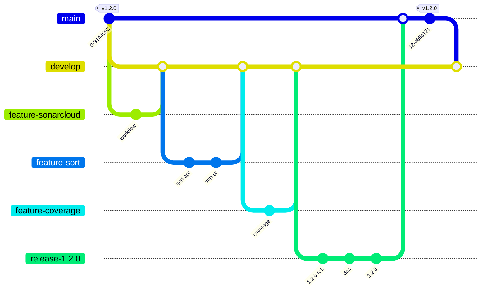

# Version 1.2.0

## Objectifs

La version 1.2.0 va apporter les modifications suivantes :

- Qualimétrie du code
- Tri des personnages par nom ou date de modification
- Augmentation de la couverture de code



## Qualimétrie du code

La qualité du code est un élément important dans le développement d'une application. Elle permet de s'assurer que le code est lisible, maintenable et évolutif. Elle permet aussi de s'assurer que le code est conforme aux bonnes pratiques de développement.

Il existe de nombreux outils pour mesurer la qualité du code. Dans le cadre de ce projet, nous allons utiliser [SonarCloud](https://sonarcloud.io/). SonarCloud est un service cloud qui permet d'analyser la qualité du code d'un projet. Il est gratuit pour les projets open source.

Afin de s'intégrer avec SonarCloud il faut au préalable se créer un compte sur [SonarCloud](https://sonarcloud.io/) avec un compte GitHub. Puis créer un projet sur SonarCloud en lui associant le repository GitHub.

### Intégration avec GitHub

Afin de pouvoir ajouter un **check status**, lors d'un Pull Request, sur la qualité de code, nous allons lancer les analyses sonarcloud depuis une github action.

Créer la branche `feature/sonarcloud` :

```bash
git switch develop
git pull
git switch -c feature/sonarcloud
```

Pour cela, nous allons créer un fichier `.github/workflows/quality.yml` avec le contenu suivant :

```yaml
name: Quality
on:
  push:
  pull_request:
jobs:
  sonarcloud:
    name: SonarCloud
    runs-on: ubuntu-latest
    steps:
      - uses: actions/checkout@v3
        with:
          fetch-depth: 0  # Shallow clones should be disabled for a better relevancy of analysis
      - uses: actions/setup-node@v3
        with:
          node-version: 18
          cache: 'npm'
      - run: npm ci
      - run: npm run test:coverage
      - name: SonarCloud Scan
        uses: SonarSource/sonarcloud-github-action@master
        env:
          GITHUB_TOKEN: ${{ secrets.GITHUB_TOKEN }}  # Needed to get PR information, if any
          SONAR_TOKEN: ${{ secrets.SONAR_TOKEN }}
      # Check the Quality Gate status.
      - name: SonarQube Quality Gate check
        id: sonarqube-quality-gate-check
        uses: sonarsource/sonarqube-quality-gate-action@master
        env:
          SONAR_TOKEN: ${{ secrets.SONAR_TOKEN }}
```

Ce fichier définit une action `Quality` qui va être lancée à chaque `push` ou `pull_request`. Cette action va :

- récupérer le code source
- installer l'environnement node
- installer les dépendances
- lancer les tests unitaires avec la couverture de code
- lancer l'analyse sonarcloud
- vérifier que la qualité du code est bonne grâce à une **Quality Gate**

Cette action utilise 2 secrets :

- `GITHUB_TOKEN` : ce token est automatiquement créé par GitHub et permet d'accéder aux informations du repository
- `SONAR_TOKEN` : ce token est créé sur SonarCloud et permet d'accéder aux informations du projet

Afin de générer le token SonarCloud, il faut se rendre sur [SonarCloud](https://sonarcloud.io/) et aller dans `My Account` > `Security` > `Generate Tokens`. Il faut ensuite ajouter le token dans les secrets du repository GitHub (Settings > Secrets and variables > New repository secret).

Il faut aussi décocher la case `Automatic Analysis` dans `Administration` > `Analysis Method` sur SonarCloud.

### Configuration de SonarCloud

Afin de faire le lien entre projet GitHub et projet SonarCloud, il faut ajouter un fichier `sonar-project.properties` à la racine du projet avec le contenu suivant :

```properties
sonar.projectKey=nom-du-projet
sonar.organization=nom-de-compte-github

sonar.javascript.lcov.reportPaths=./coverage/lcov.info
sonar.coverage.exclusions=**/*.test.js
```

Ce fichier définit les propriétés du projet SonarCloud :

- `sonar.projectKey` : identifiant du projet SonarCloud
- `sonar.organization` : organisation SonarCloud
- `sonar.javascript.lcov.reportPaths` : chemin vers le fichier de couverture de code
- `sonar.coverage.exclusions` : fichiers à exclure de la couverture de code

Les informations `sonar.projectKey` et `sonar.organization` sont disponibles sur la page du projet SonarCloud dans la section **Information**.

Commiter et pusher les modifications :

```bash
git add .github/workflows/quality.yml
git add sonar-project.properties
git commit -m "Add sonarcloud analysis"
git push --set-upstream origin feature/sonarcloud
```

### Vérification de la qualité du code

A chaque push, une analyse de la qualité du code est lancée. Elle est visible dans l'onglet `Actions` du repository, si le code ne passe pas la **Quality Gate**, l'action est en erreur. Il faut alors corriger les problèmes de qualité du code. On peut aussi voir l'analyse sur SonarCloud.

Nous n'avons pas défini de **Quality Gate** personnalisée, nous utilisons donc la **Quality Gate** par défaut de SonarCloud. Il serait possible de définir une **Quality Gate** personnalisée, mais cela n'est pas nécessaire dans le cadre de ce projet.

La **Quality Gate** par défaut de SonarCloud possède les critères suivants :

- **Coverage** : 80%, il ne faut pas que la couverture de code soit inférieure à 80%
- **Duplicated Lines** : 3%, il ne faut pas que le code dupliqué soit supérieur à 3%, si l'on possède du code dupliqué, il faut le factoriser grâce à des fonctions.
- **Maintainability Rating** : A, il faut que la note de maintenabilité soit supérieure à A, si la note est inférieure à A, il faut améliorer la qualité du code. La note de maintenabilité est calculée à partir de la complexité du code, de la taille du code, etc...
- **Reliability Rating** : A, il faut que la note de fiabilité soit supérieure à A, si la note est inférieure à A, il faut améliorer la qualité du code. La note de fiabilité est calculée à partir de la présence de bugs, de la présence de code mort, etc...
- **Security Rating** : A, il faut que la note de sécurité soit supérieure à A, si la note est inférieure à A, il faut améliorer la qualité du code. La note de sécurité est calculée à partir de la présence de failles de sécurité, etc...
- **Security Hotspots Reviewed** : 0, il ne faut pas de failles de sécurité, si il y en a, il faut les corriger.

Si le code ne passe pas la **Quality Gate**, il faut corriger les problèmes de qualité du code. Il peut être nécessaire de modifier le code, d'ajouter des tests unitaires, de factoriser du code, etc...

Une fois l'action `Quality` passée une première fois, nous pouvons ajouter ce nouveau check status dans la protection des branches `main` et `develop`.

Nous avons maintenant des contrôles de qualité du code à chaque push et pull request. 

Faire le nécessaire pour merger la branche `feature/sonarcloud` dans `develop`(pull request, review, merge).

## Tri des personnages par nom ou date de modification

Créer la branche `feature/sort` :

```bash
git switch develop
git pull
git switch -c feature/sort
```

### Modification de l'UI

Modifier le fichier `src/pages/CharactersPage.js` pour ajouter les paramètres `orderBy` et `order` :

```javascript
import React, { useState } from 'react';
import { CharactersList } from "../components/CharactersList";
import { NumberOfCharacters } from "../components/NumberOfCharacters";

import { useLoaderData } from 'react-router';
import { useSearchParams } from 'react-router-dom';

const CharactersPage = () => {
    // change the title of the page
    document.title = "Marvel App";

    // retrieve the characters using the useLoaderData hook
    const characters = useLoaderData();

    // Get the search params from the URL
    let [searchParams, setSearchParams] = useSearchParams();

    // Get the order and orderBy from the search params or set the default values
    const [order, setOrder] = useState(searchParams.get('order') || 'asc')
    const [orderBy, setOrderBy] = useState(searchParams.get('orderBy') || 'name')

    // Update the search params when the order or orderBy state changes
    React.useEffect(() => {
        setSearchParams({ order, orderBy })
    }, [order, orderBy, setSearchParams])

    return (
        <>
            <h2>Marvel Characters</h2>
            {/* Sort by  */}
            <label htmlFor="sort">Sort by:</label>
            <select data-testid='orderBy' value={orderBy} onChange={(e) => setOrderBy(e.target.value)}>
                <option value="name">Name</option>
                <option value="modified">Modified</option>
            </select>   
            &nbsp;
            {/* Order */}
            <label htmlFor="order">Order:</label>
            <select data-testid='order' value={order} onChange={(e) => setOrder(e.target.value)}>
                <option value="asc">Ascending</option>
                <option value="desc">Descending</option>
            </select>         
            <CharactersList characters={characters} />
            <br />
            <NumberOfCharacters characters={characters} />
        </>
    );
};

export default CharactersPage;
```

On utilise le hook `useSearchParams` pour récupérer les paramètres de l'URL. 

Le hook `useSearchParams` retourne un tableau avec 2 éléments :

- le premier élément est un objet qui permet de récupérer les paramètres de l'URL
- le second élément est une fonction qui permet de mettre à jour les paramètres de l'URL

Ensuite le hook `useState` permet de gérer les paramètres `orderBy` et `order` en les stockant dans le state. 

On utilise le hook `useEffect` pour mettre à jour les paramètres de l'URL lorsque les paramètres `orderBy` et `order` changent.

Modifier le fichier de test `src/App.test.js` :

```javascript
import { render, screen } from '@testing-library/react';
import App from './App';
import { act } from 'react-dom/test-utils';

test('render Marvel App', async () => {
  await act(() => {
    render(<App />);
  });


  const h1Element = screen.getByRole('heading', { level: 1, name: "Marvel App" });
  expect(h1Element).toBeInTheDocument();
});
```

Modifier le fichier de test `src/pages/CharactersPage.test.js` :

```javascript
import { render, screen } from '@testing-library/react';
import CharactersPage from './CharactersPage';
import { BrowserRouter, MemoryRouter } from 'react-router-dom';
import { act } from 'react-dom/test-utils';

const characters = [
    {
        id: "1",
        name: "Thor"
    }
];

// mock the useLoaderData hook, so that we can test the CharactersPage component
jest.mock('react-router', () => ({
    ...jest.requireActual('react-router'), // use actual for all non-hook parts
    useLoaderData: () => {
        return characters;
    },
}));

describe('CharactersPage', () => {

    test('render CharactersPage component with default order and orderBy', () => {
        // when

        // then
        render(
            <MemoryRouter initialEntries={[`/`]} >
                <CharactersPage />
            </MemoryRouter>
        );

        // expect the document title to be "Marvel App"
        expect(document.title).toBe('Marvel App');


        // expect the heading 'Marvel Characters' to be in the document
        const h2Element = screen.getByRole('heading', { level: 2, name: "Marvel Characters" });
        expect(h2Element).toBeInTheDocument();

        // expect the character Thor to be in the document
        const thorElement = screen.getByText(characters[0].name);
        expect(thorElement).toBeInTheDocument();

        // expect the number of characters to be in the document
        const numberOfCharactersElement = screen.getByText(`There is ${characters.length} character`);
        expect(numberOfCharactersElement).toBeInTheDocument();
    });

    test('render CharactersPage component with order and orderBy from search params', async () => {
        // when
        const order = 'desc';
        const orderBy = 'modified';

        // then
        render(
            <MemoryRouter initialEntries={[`/?order=${order}&orderBy=${orderBy}`]} >
                <CharactersPage />
            </MemoryRouter>
        );

        // expect the document title to be "Marvel App"
        expect(document.title).toBe('Marvel App');

        // expect the heading 'Marvel Characters' to be in the document
        const h2Element = screen.getByRole('heading', { level: 2, name: "Marvel Characters" });
        expect(h2Element).toBeInTheDocument();

        // expect the character Thor to be in the document
        const thorElement = screen.getByText(characters[0].name);
        expect(thorElement).toBeInTheDocument();

        // expect the number of characters to be in the document
        const numberOfCharactersElement = screen.getByText(`There is ${characters.length} character`);
        expect(numberOfCharactersElement).toBeInTheDocument();


        const orderSelect = screen.getByTestId('order');
        expect(orderSelect).toHaveValue(order);

        // expect the orderBy select to have the value from the search params
        const orderBySelect = screen.getByTestId('orderBy');
        expect(orderBySelect).toHaveValue(orderBy);
    });

    test('render CharactersPage component with order and orderBy when the select changes', async () => {
        // when
        const order = 'desc';
        const orderBy = 'modified';

        // then
        render(
            <MemoryRouter initialEntries={[`/`]} >
                <CharactersPage />
            </MemoryRouter>
        );

        // when
        await act(() => {
            // change the order select to desc
            const orderSelect = screen.getByTestId('order');
            orderSelect.value = order;
            orderSelect.dispatchEvent(new Event('change', { bubbles: true }));

            // then
            expect(orderSelect).toHaveValue(order);

            // change the orderBy select to modified
            const orderBySelect = screen.getByTestId('orderBy');
            orderBySelect.value = orderBy;
            orderBySelect.dispatchEvent(new Event('change', { bubbles: true }));

            // then
            expect(orderBySelect).toHaveValue(orderBy);
        });
    });
});
```

On utilise le composant `MemoryRouter` pour tester les paramètres de l'URL. Le composant `MemoryRouter` permet de simuler un router sans avoir besoin d'un navigateur. 

On utilise le composant `act` pour tester les changements de valeur des `select`, on simule ainsi une action de l'utilisateur.

On peut maintenant récupérer les paramètres `orderBy` et `order` dans l'URL et les utiliser pour trier les personnages.

Modifier le fichier `src/routes.js` pour ajouter les paramètres `orderBy` et `order` :

```javascript
import Layout from "./Layout";
import AboutPage from "./pages/AboutPage";
import ContactPage from "./pages/ContactPage";
import CharactersPage from "./pages/CharactersPage";

import CharacterDetailPage from "./pages/CharacterDetailPage";
import { getCharacterById, getCharacters } from "./api/character-api";

const routes = [
    {
        path: "/",
        element: <Layout />,
        children: [
            {
                path: "/",
                element: <CharactersPage />,
                loader: ({request}) => {
                    const url = new URL(request.url);
                    const orderBy = url.searchParams.get("orderBy");
                    const order = url.searchParams.get("order");

                    if (orderBy && order) {
                        return getCharacters(orderBy, order);
                    }else{
                        return getCharacters();
                    }
                },
            },
            {
                path: "/characters/:id",
                element: <CharacterDetailPage />,
                loader: ({ params }) => getCharacterById(params.id),
            },
            { 
                path: "/about", 
                element: <AboutPage /> 
            },
            { 
                path: "/contact", 
                element: <ContactPage /> 
            },
        ],
    },
];

export default routes;
```

On utilise le composant `URL` pour récupérer les paramètres `orderBy` et `order` de l'URL. On les passe ensuite à la fonction `getCharacters` de l'API.

Vérifier que les tests passent et que l'application fonctionne correctement, si ce n'est pas le cas, corriger les problèmes. 

Remarque: La fonction `getCharacters` de l'API ne gère pas encore les paramètres `orderBy` et `order`, nous allons les ajouter dans la prochaine partie, il est donc normal que le tri ne fonctionne pas encore.

Une fois que tout est ok, commiter et pusher les modifications :

```bash
git add src/pages/CharactersPage.js
git add src/App.test.js
git add src/pages/CharactersPage.test.js
git add src/routes.js
git commit -m "Add sort by and order in CharactersPage"
git push --set-upstream origin feature/sort
```

### Modification de l'API

Modifier le fichier `src/api/character-api.js` pour ajouter les paramètres `orderBy` et `order` à la fonction `getCharacters` :

```javascript
const characters = require('../data/characters.json');

/**
 * Get all characters from json file
 * @returns 
 */
function getCharacters(orderBy = 'name', order = 'asc') {
    // Sort characters by name
    let sortedCharacters = characters.sort((a, b) => {
        if (orderBy === 'name') {
            return a.name.localeCompare(b.name)
        } else if (orderBy === 'modified') {
            return new Date(b.modified) - new Date(a.modified)
        } else {
            throw new Error(`Invalid orderBy parameter: ${orderBy}`)
        }
    })

    // Reverse the order if it is descending
    if (order === 'desc') {
        sortedCharacters.reverse()
    }

    return sortedCharacters
}

/**
 * Get character by id
 * @param {number} id 
 * @returns 
 */
function getCharacterById(id) {
    // If id is a number, convert it to string
    if (typeof id === 'number') {
        id = id.toString()
    }

    if (typeof id !== 'string') {
        throw new Error(`Parameter id must be a number or a string, but it was ${typeof id}`)
    }

    // Find character by id
    const character = characters.find((character) => character.id === id)

    // Throw error if character is not found
    if (!character) {
        throw new Error(`Character with id ${id} not found`)
    }
    return character
}

module.exports = {
    getCharacters,
    getCharacterById
}
```

On utilise les paramètres `orderBy` et `order` pour trier les personnages. La fonction `sort` permet de trier un tableau. On utilise la fonction `localeCompare` pour trier les personnages par nom, la fonction `Date` pour trier les personnages par date de modification. La fonction `sort` trie les éléments en fonction du résultat de la fonction de comparaison.

On utilise la fonction `reverse` pour inverser l'ordre des personnages si l'ordre est `desc`.

Voir la documentation de la fonction `sort` [ici](https://developer.mozilla.org/fr/docs/Web/JavaScript/Reference/Objets_globaux/Array/sort).

Modifier le fichier de `src/api/character-api.test.js` pour prendre en compte les paramètres `orderBy` et `order` :

```javascript
const { getCharacters, getCharacterById } = require('./character-api');
const fs = require('fs');

describe('character-api', () => {
  const expected = JSON.parse(fs.readFileSync('src/data/characters.json', 'utf8'));

  describe('getCharacters', () => {
    it('returns all characters sorted by name ascending by default', () => {
      // when

      // then
      const characters = getCharacters();

      // expect the first character to be Beast
      expect(characters[0].name).toBe('Beast');

      // expect the last character to be Wolverine
      expect(characters[characters.length - 1].name).toBe('Wolverine');
    });

    it('returns all characters sorted by modified descending', () => {
      // when

      // then
      const characters = getCharacters('modified', 'desc');

      // expect the first character to be Wolverine
      expect(characters[0].name).toBe('Groot');

      // expect the last character to be Beast
      expect(characters[characters.length - 1].name).toBe('Hulk');
    });

    it('throws an error if orderBy is invalid', () => {
      // when
      const orderBy = 'foo';

      // then
      expect(() => {
        getCharacters(orderBy);
      }).toThrow(`Invalid orderBy parameter: ${orderBy}`);
    });

  });

  describe('getCharacterById', () => {
    test('returns the character with the given id when id is a string', () => {
      // when
      const id = "1009663";
      const name = "Thor";

      // then
      const character = getCharacterById(id);

      // expect
      expect(character.id).toBe(id);
      expect(character.name).toBe(name);
    });

    test('returns the character with the given id when id is a number', () => {
      // when
      const id = 1009663;
      const name = "Thor";

      // then
      const character = getCharacterById(id);

      // expect
      expect(character.id).toBe(id.toString());
      expect(character.name).toBe(name);
    });

    test('throws an error if id is not provided', () => {
      expect(() => {
        getCharacterById();
      }).toThrow(`Parameter id must be a number or a string, but it was undefined`);
    });

    test('throws an error if id is not a number or a string', () => {
      expect(() => {
        getCharacterById({});
      }).toThrow(`Parameter id must be a number or a string, but it was object`);
    });

    test('throws an error if character with given id is not found', () => {
      const id = 999;
      expect(() => {
        getCharacterById(id);
      }).toThrow(`Character with id ${id} not found`);
    });
  });
});
```

Vérifier que les tests passent et que l'application fonctionne correctement, si ce n'est pas le cas, corriger les problèmes. Maintenant le tri des personnages devrait fonctionner correctement.

Commiter et pusher les modifications :

```bash
git add src/api/character-api.js
git add src/api/character-api.test.js
git commit -m "Add sort by and order in character-api"
git push --set-upstream origin feature/sort
```

Créer la pull request `feature/sort` afin de voir si le nouveau code passe bien les différents contrôles (tests unitaires, qualité du code). Une fois la pull request validée, merger la branche `feature/sort` dans `develop`.

## Augmentation de la couverture de code

Il reste encore des parties du code qui ne sont pas couvertes par les tests unitaires. Nous allons augmenter la couverture de code afin d'avoir une couverture de code la plus haute possible.

Créer la branche `feature/coverage` :

```bash
git switch develop
git pull
git switch -c feature/coverage
```

### src/components

Modifier le fichier `src/components/CharacterDetail.test.js` pour ajouter les tests unitaires manquants :

```javascript
import { render, screen } from '@testing-library/react';
import { CharactersList } from './CharactersList';
import { BrowserRouter } from 'react-router-dom'
import CharacterDetail from './CharacterDetail';

describe('CharactersDetail', () => {
    it('renders the character detail', () => {
        // when 
        const character = {
            id: "1",
            name: "Thor",
            description: "Thor description",
            thumbnail: {
                path: "https://foo.bar",
                extension: "jpg"
            }
        }

        // then
        render(<CharacterDetail character={character} />, { wrapper: BrowserRouter });  

        // expect a heading with the character name
        const h2Element = screen.getByRole('heading', { level: 2, name: character.name });
        expect(h2Element).toBeInTheDocument();

        // expect a paragraph with the character description
        const pElement = screen.getByText(character.description);
        expect(pElement).toBeInTheDocument();

        // expect an image with the character thumbnail
        const imgElement = screen.getByRole('img', { name: character.name });
        expect(imgElement).toBeInTheDocument();
        expect(imgElement).toHaveAttribute('src', `${character.thumbnail.path}/standard_large.${character.thumbnail.extension}`);
    });

    it('renders the character detail without a thumbnail', () => {
        // when 
        const character = {
            id: "1",
            name: "Thor",
            description: "Thor description",
        }

        // then
        render(<CharacterDetail character={character} />, { wrapper: BrowserRouter });  

        // expect a heading with the character name
        const h2Element = screen.getByRole('heading', { level: 2, name: character.name });
        expect(h2Element).toBeInTheDocument();

        // expect a paragraph with the character description
        const pElement = screen.getByText(character.description);
        expect(pElement).toBeInTheDocument();

        // expect no image
        const imgElement = screen.queryByRole('img', { name: character.name });
        expect(imgElement).not.toBeInTheDocument();
    });

    it('renders nothing when no character is provided', () => {
        // when

        // then
        render(<CharacterDetail />, { wrapper: BrowserRouter });  

        // expect empty h2 element
        const h2Element = screen.queryByRole('heading', { level: 2 });
        expect(h2Element).toBeEmptyDOMElement();        
    });
});

```

### src/pages

Modifier le fichier `src/pages/ContactPage.test.js` :

```javascript
import { render, screen } from '@testing-library/react';
import ContactPage from './ContactPage';

test('renders Contact us message', () => {
    // when

    // then
    render(<ContactPage />);

    // expect the document title to be "Contact | Marvel App"
    expect(document.title).toEqual("Contact | Marvel App");

    // expect the heading and the paragraph to be in the document
    const h2Element = screen.getByRole('heading', { level: 2, name: "Contact Us" });
    const pElement = screen.getByText('Feel free to contact us at');
    
    expect(h2Element).toBeInTheDocument();
    expect(pElement).toBeInTheDocument();

    // expect to have a mailto link
    const mailAddress = "marvelApp@gmail.com";
    const mailtoLink = screen.getByRole('link', { name: mailAddress });
    expect(mailtoLink).toBeInTheDocument();
    expect(mailtoLink).toHaveAttribute('href', `mailto:${mailAddress}`);
    expect(mailtoLink).toHaveTextContent(mailAddress);
});

```

La couverture de code est maintenant à 100% pour les fichiers `src/components` et `src/pages`.

Commiter et pusher les modifications :

```bash
git add src/components/CharacterDetail.test.js
git add src/pages/ContactPage.test.js
git commit -m "Add missing unit tests"
git push --set-upstream origin feature/coverage
```

## Release 1.2.0

Faire le nécessaire pour créer la release `1.2.0` contenant l'ensemble des modifications de la version 1.2.0.

Puis à mettre à jour les branches `main` et `develop`.