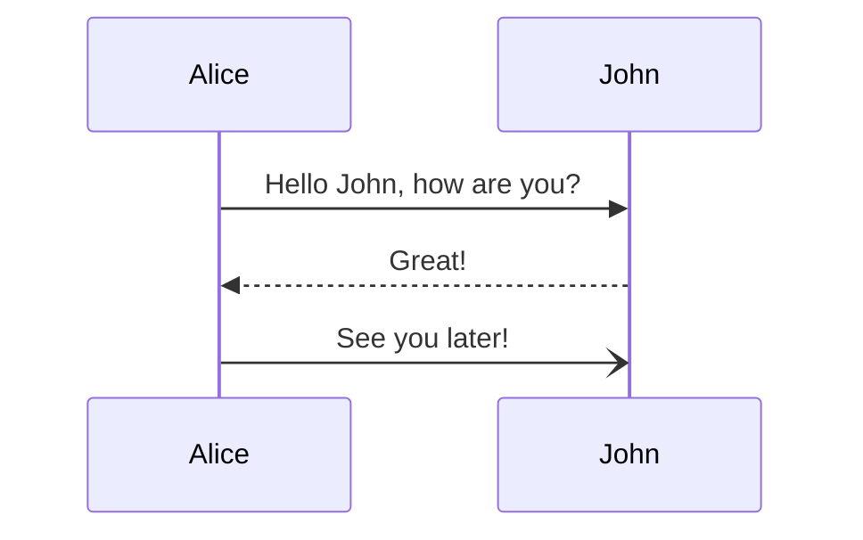
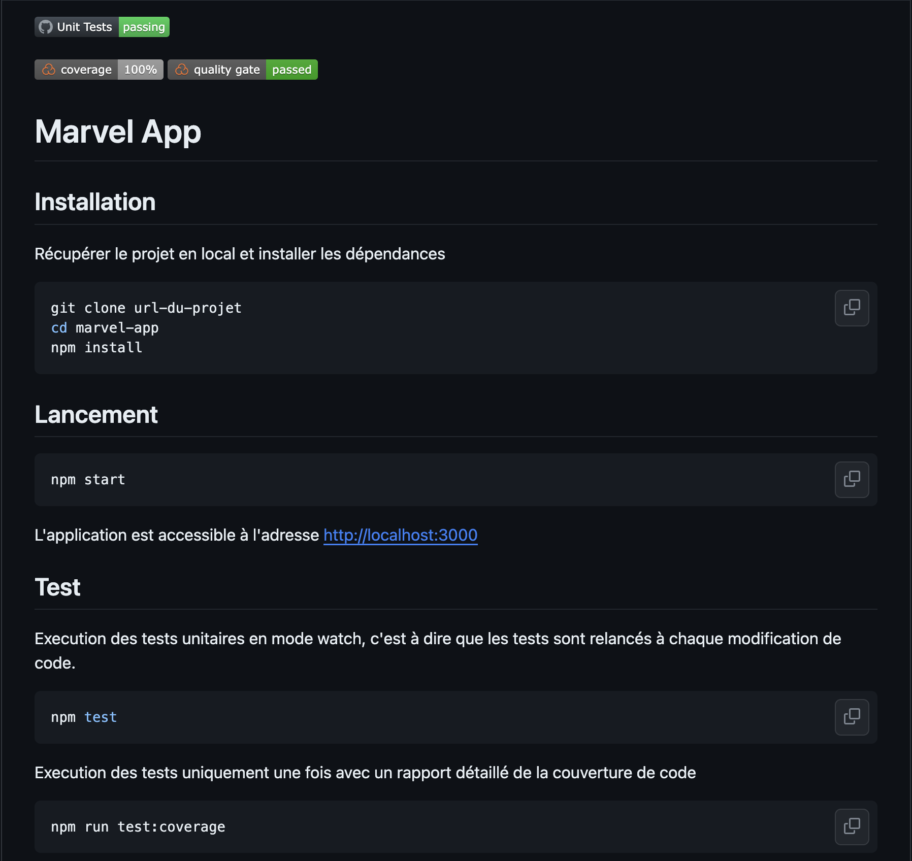
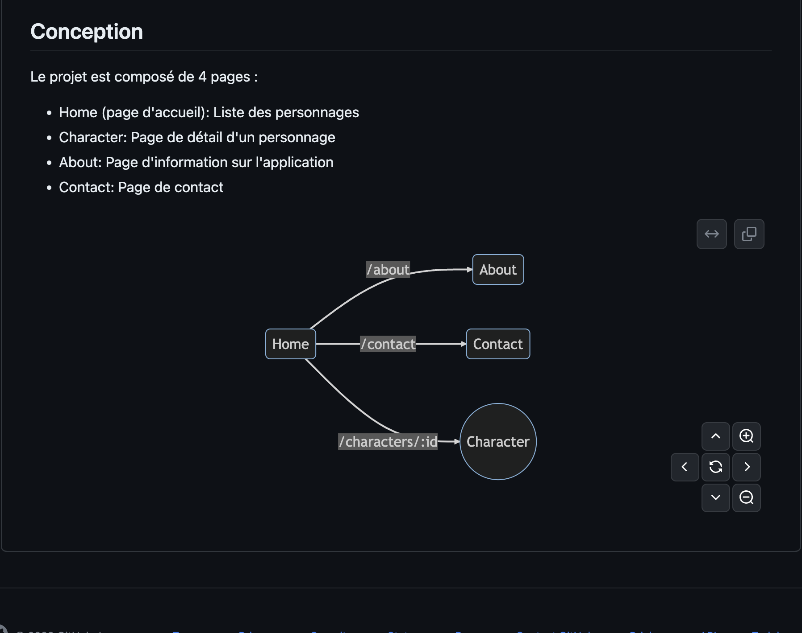
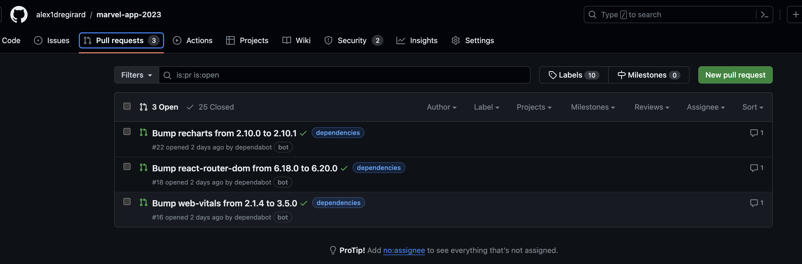

# Version 1.4.0

## Objectifs

- Ajout de documentation grâce au langage Markdown
- Mise en oeuvre de `dependabot` pour la mise à jour automatique des dépendances et la création de PR associées

## Documentation

Markdown est un langage de balisage léger créé en 2004 par John Gruber avec l'aide d'Aaron Swartz. Son but est d'offrir une syntaxe facile à lire et à écrire. Un document balisé par Markdown peut être lu en l'état sans donner l'impression d'avoir été marqué par des balises ou des instructions particulières.

Le fichier README.md est un fichier Markdown. Il est possible de le lire directement sur GitHub ou de le convertir en HTML pour l'afficher dans un navigateur.

### Syntaxe

Plus de détail sur le site [markdownguide](https://www.markdownguide.org/basic-syntax/)

La syntaxe Markdown est très simple. Elle permet de mettre en forme du texte en ajoutant des caractères spéciaux. Par exemple, pour mettre un mot en gras, il suffit de l'entourer de deux astérisques `**` ou de deux tirets bas `__`.

#### Titres

Pour créer un titre, il faut utiliser le caractère `#` suivi du titre. Il est possible d'utiliser jusqu'à 6 caractères `#` pour créer un titre de niveau 6.

```markdown 
# Titre de niveau 1
## Titre de niveau 2
```
#### Paragraphes

Pour créer un paragraphe, il faut écrire le texte du paragraphe sur une seule ligne.

```markdown 
Ceci est un paragraphe.
```

#### Texte

**Italique**

Pour mettre du texte en italique, il faut entourer le texte avec le caractère `*` ou `_`.

```markdown
*Texte en italique*
_Texte en italique_
```
**Gras**

Pour mettre du texte en gras, il faut entourer le texte avec le caractère `**` ou `__`.

```markdown
**Texte en gras**
__Texte en gras__
```

**Italique et gras**

Pour mettre du texte en italique et en gras, il faut entourer le texte avec le caractère `***` ou `___`.

```markdown     
***Texte en italique et en gras***
___Texte en italique et en gras___
```

**Barré**

Pour barrer du texte, il faut entourer le texte avec le caractère `~~`.

```markdown
~~Texte barré~~
```

Ceci est un paragraphe d'exemple avec du texte en _italique_, __en gras__ et ~~barré~~ et un ___texte en italique et en gras___.

#### Listes

Pour créer une liste, il faut utiliser le caractère `-` ou `*` suivi du texte de l'élément de la liste.

```markdown
- Élément 1 
- Élément 2
```

**Listes ordonnées**

Pour créer une liste ordonnée, il faut utiliser le caractère `1.` suivi du texte de l'élément de la liste.

```markdown     
1. Élément 1
2. Élément 2
```

**Listes imbriquées**

Pour créer une liste imbriquée, il faut utiliser le caractère `-` ou `*` suivi du texte de l'élément de la liste.

```markdown
- Élément 1
  - Élément 1.1
  - Élément 1.2
- Élément 2
```

**Listes imbriquées ordonnées**

Pour créer une liste imbriquée ordonnée, il faut utiliser le caractère `1.` suivi du texte de l'élément de la liste.

```markdown
1. Élément 1
   1. Élément 1.1
   2. Élément 1.2   
2. Élément 2
```

#### Liens

Pour créer un lien, il faut utiliser le caractère `[` suivi du texte du lien, puis du caractère `]` suivi de l'URL du lien entre parenthèses `()`.

```markdown
[Texte du lien](https://www.google.com)
```
#### Images

Pour insérer une image, il faut utiliser le caractère `!` suivi du caractère `[` suivi du texte alternatif de l'image, puis du caractère `]` suivi de l'URL de l'image entre parenthèses `()`.

```markdown 

```

#### Code

Pour insérer du code, il faut utiliser le caractère ` (Alt Gr + 7) pour insérer du code sur une ligne ou le caractère ``` pour insérer du code sur plusieurs lignes.

Il est possible de spécifier le langage du code pour avoir une coloration syntaxique, par exemple ` ```javascript ` pour du code JavaScript, ` ```python ` pour du code Python, etc.

```javascript
function hello() {
    console.log("Hello World!");
} 
```

```python
def hello():
    print("Hello World!")
```
    
#### Tableaux

Pour créer un tableau, il faut utiliser le caractère `|` pour séparer les colonnes et le caractère `-` pour séparer la première ligne du reste du tableau.

```markdown
| Colonne 1 | Colonne 2 |
| --------- | --------- |
| Ligne 1   | Ligne 1   |
| Ligne 2   | Ligne 2   |
```

#### Badges

Il est possible d'ajouter des badges dans le fichier README.md pour afficher des informations sur le projet. Par exemple, il est possible d'ajouter un badge pour afficher le nombre de téléchargements du projet sur npm.

```markdown
[](https://www.npmjs.com/package/express)
```

[](https://www.npmjs.com/package/express)

Les badges sont des images hébergées sur le site [shields.io](https://shields.io/). Il est possible de créer des badges pour afficher des informations sur le projet, par exemple le nombre de téléchargements, le nombre de stars sur GitHub, etc.

Les github actions permettent d'ajouter des badges pour afficher le statut des workflows. SonarCloud permet d'ajouter des badges pour afficher la qualité du code, la couverture des tests, etc.

#### Mermaid

Il est possible d'ajouter des diagrammes grâce à la librairie [mermaid](https://mermaid-js.github.io/mermaid/#/). Par exemple, pour créer un diagramme de séquence, il faut utiliser la syntaxe suivante :

```markdown



### README.md

Mettre à jour le fichier README.md du projet pour tester la syntaxe Markdown.





## Dependabot

Dependabot est un service qui permet de mettre à jour automatiquement les dépendances d'un projet et de créer des PR associées.

Pour configurer dependabot, il faut créer un fichier `.github/dependabot.yml`. Ce fichier permet de configurer les dépendances à mettre à jour et la fréquence de mise à jour.

```yaml
# To get started with Dependabot version updates, you'll need to specify which
# package ecosystems to update and where the package manifests are located.
# Please see the documentation for all configuration options:
# https://docs.github.com/github/administering-a-repository/configuration-options-for-dependency-updates

version: 2
updates:
  - package-ecosystem: "npm" # See documentation for possible values
    directory: "/" # Location of package manifests
    schedule:
      interval: "weekly"
    groups:
      dev-dependencies:
        dependency-type: development
```

Une fois le fichier de configuration présent sur la branche principale, des PR sont automatiquement créées pour mettre à jour les dépendances.



Du fait que le projet est configuré pour lancer la construction et l'exécution des tests à chaque PR, une PR valide peut être mergé sans risque. Il est possible de configurer dependabot pour qu'il merge automatiquement les PR valides.

La mise en oeuvre de dependabot permet de maintenir à jour les dépendances du projet et de s'assurer que le projet reste compatible avec les dernières versions des dépendances et de corriger les vulnérabilités lorsque cela est possible.


