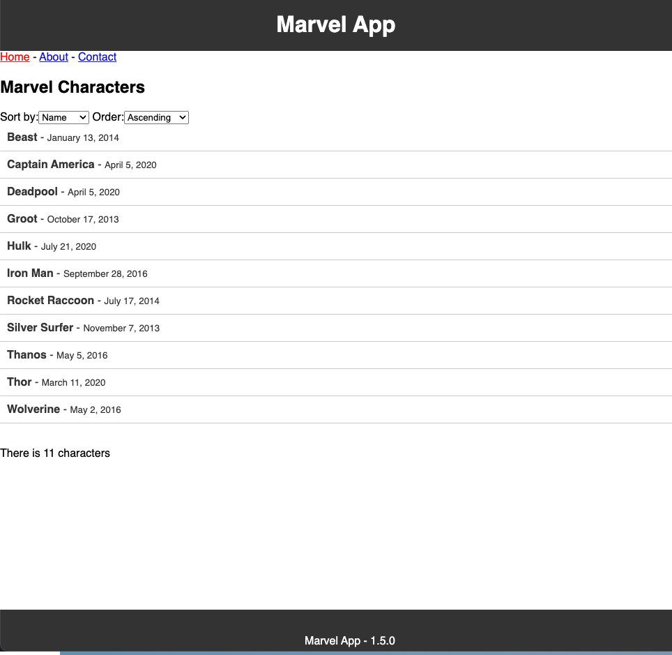
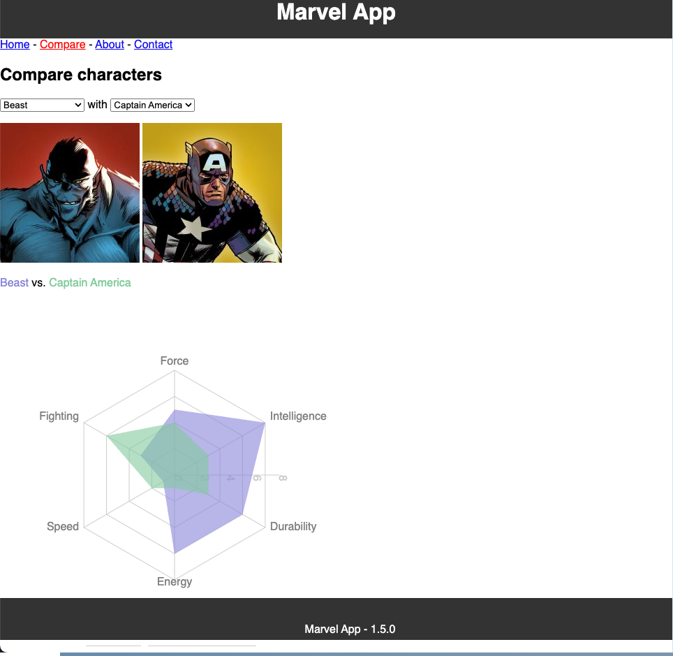

# Version 1.5.0

## Objectifs

- Evaluation des compétences acquises en développement web
- Evaluation des compétences acquises en bonnes pratiques de développement

## Session 1

Session 1 - Lundi 4 Décembre 2023

### Consignes

- Afficher la date de modification du personnage (donnée `modified` d'un personnage) dans un format lisible par un humain, la date de modification est au format ISO 8601 et ne doit pas être modifiée dans le fichier JSON
- Ajouter l'affichage de cette date dans la liste des personnages
- Faire en sorte que cette date s'affiche de la même manière (format de la date) dans la liste des personnages et dans le détail d'un personnage

Le visuel attendu pour la liste des personnages devrait ressembler à ceci :

### Remarques

- La librairie `date-fns` permet de manipuler des dates en JavaScript
- Le fait de modifier le comportement des pages a un impact sur les tests unitaires associés à ces pages.
    - Il faut donc les modifier pour qu'ils passent à nouveau et/ou ajouter de nouveaux tests unitaires et/ou adapter le composant pour gérer les différents cas de figure.
    - le test `CharactersList.test.js` vérifie la présence de lien à partir du nom des personnages, ce test n'est peut-être plus adapté et doit être modifié pour vérifier la présence de lien à partir d'un identifiant unique (donnée `id` d'un personnage), la propriété `data-testid` et la méthode `getByTestId` pourraient être utiles
    - Il est possible de modifier le jeu de données de test (attention pas les données `src/data/characters.json`) pour vérifier le comportement attendu du composant
- Les balises `<strong>` et `<small>` sont des balises HTML qui permettent de mettre en forme du texte, en mettant en avant certains mots ou en réduisant la taille du texte. Elles peuvent être utilisées dans un composant React comme n'importe quelle autre balise HTML

### Evaluation

#### Questions

Répondre aux questions suivantes dans un fichier `answers.md` à la racine du projet.

*git*

- Quel est l'intérêt de commiter régulièrement et de manière atomique ?
- A quoi sert une branche de type `feature` dans un développement logiciel de type `git flow` ?
- Quelle est la différence entre une branche `main` et une branche `develop` ?
- Quelle est la différence entre `git add`, `git commit` et `git push` ?

*github*

- Quel est l'intérêt d'une protection de branche ?
- Quel est l'intérêt d'une pull request ?

*versionning*

- Dans quel cas passer d'une version `1.0.0` à `1.0.1` ?
- Dans quel cas passer d'une version `1.0.0` à `1.1.0` ?
- A quoi sert une version `release candidate` ?

*test*

- Quel est l'intérêt des tests unitaires ?

#### Code

- Les bonnes pratiques de développement doivent être respectées (commit, nommage, formatage, ...) afin de faciliter la relecture du code et seront évaluées,
- Proposer cette modification à l'équipe de développement (alex1dregirard) pour une éventuelle intégration au projet si elle est jugée pertinente, c'est cette modification qui sera évaluée, 
- Les modifications doivent être validées en fin de session 1, aucune modification ne sera acceptée après la fin de la session.  

<!-- 
## Session 2

Session 2 - Mercredi 6 Décembre 2023

### Consignes

- Créer une page permettant de comparer deux personnages
- Ajouter un élément de navigation permettant d'accéder à cette page

Le visuel attendu pour la page de comparaison devrait ressembler à ceci :

### Remarques

- La libraire `recharts` et plus particulièrement le composant `RadarChart` permet de créer le graphique de comparaison. Voir la documentation de la librairie pour plus d'informations. [https://recharts.org/en-US/api/RadarChart](https://recharts.org/en-US/api/RadarChart)

### Evaluation

#### Questions

Répondre aux questions suivantes dans un fichier `answers.md` à la racine du projet.

*méthode agile*

- Quel est l'intérêt d'une méthode agile dans un projet de développement logiciel ?
- Quel est l'intérêt d'un sprint dans une méthode agile ?

*librairie*

- Quel est l'intérêt d'utiliser une librairie externe ?
- Quelles sont les précautions à prendre lors de l'utilisation d'une librairie externe ?

*composant*

- Quel est l'intérêt de découper une application en composants ?

*test*

- Est-ce qu'une couverture de test à 100% garantie l'absence de bug ?
- Un test unitaire utilise-t-il des données réelles ou des données fictives ?
- Quel est le but d'un mock ?

*documentation*

- Quel est l'intérêt du fichier README.md ?

*code*

- Les principes de développement mis en oeuvre peuvent-ils être appliqués à d'autres projets, d'autres langages ?

#### Code

- Comme pour la session 1, proposer cette modification à l'équipe de développement (alex1dregirard) pour une éventuelle intégration au projet si elle est jugée pertinente, c'est cette modification qui sera évaluée,
- Les modifications doivent être validées en fin de session 2, aucune modification ne sera acceptée après la fin de la session. -->
